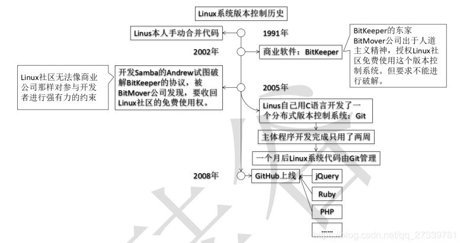
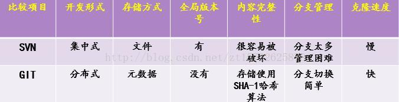
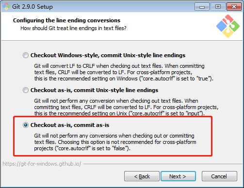
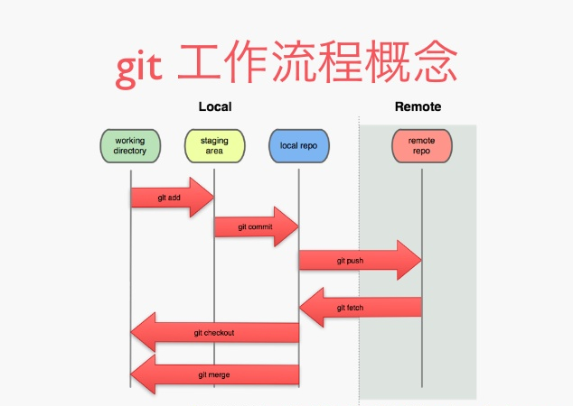

# 第一章 Git 基本介绍

## Git的历史



同生活中的许多伟大事物一样，Git 诞生于一个极富纷争大举创新的年代。Linux 内核开源项目有着为数众广的参与者。 绝大多数的 Linux 内核维护工作都花在了提交补丁和保存归档的繁琐事务上（1991－2002年间）。 到 2002 年，整个项目组开始启用一个专有的分布式版本控制系统 BitKeeper 来管理和维护代码。

到了 2005 年，开发 BitKeeper 的商业公司同 Linux 内核开源社区的合作关系结束，他们收回了 Linux 内核社区免费使用 BitKeeper 的权力。 这就迫使 Linux 开源社区（特别是 Linux 的缔造者 Linus Torvalds）基于使用 BitKeeper 时的经验教训，开发出自己的版本系统。 他们对新的系统制订了若干目标：

## Git 简介


- Git 是目前世界上被最广泛使用一款免费、`开源的分布式版本控制系统`

- Git可以有效、高速的处理从很小到非常大的项目版本管理。

- Git最初由 Linux 之父 Linus Trovalds（林纳斯·托瓦兹） 开发，用作Linux内核代码的管理。
- Git 使用分散式架构，是分散式版本管理，相较于例如 CVS 或者 Subversion 等集中式版本管理软件，Git 并不是将代码的所有修改历史保存在中心服务器中的。

## Git的优点

### 性能

Git 的底层性能相较于其他版本管理软件有强大的优势。在 Git 中所有的操作包括提交修改，创建分支，融合分支，以及求取差分都经过了性能优化。这些优化来自于 Git 的开发者对实际一般代码开发模式的深度认识和广泛知识。

不同于某些版本管理软件，Git 在决定代码修改历史以及保存形式的时候不会被文件名的变化所愚弄，Git 关注的是文件的内容本身。在实际操作中，代码文件经历频繁的再命名，分解和合并。Git 使用一种混合了差分编码（delta encoding，仅保存代码修改的差分），压缩，直接保存，以及版本元数据（version metadata objects）的管理方式。分散式的架构也给 Git 带来了极大的性能优势。

### 安全性

Git 将保持所管理代码的整合性作为首要要务。所有的文件内容，文件相互关系，以及文件目录结构，版本，标签以及修改，都经过加密哈希校验算法（SHA1）的保护。这可以防止各种意外的代码修改失误，或者是第三者的恶意修改，使得代码修改历史完全可追迹。

使用 Git 你可以确信你拥有代码的完整修改历史。

### 柔软性

Git 的关键设计目标之一就是保持柔软性。Git 在以下方面都展现出了其柔软性：支持各种非线性的开发工作流程，对或大或小的软件项目都可以良好支持，以及兼容各种操作系统和协议。

Git 支持将分支和标签作为一级基本对象（不同于 SVN），所以所有对分支和标签的操作也都会被保存到修改历史中。并不是所有的版本管理软件支持这一层面的追迹。

## Github简介


- Github是全球最大的社交编程及代码托管网站（https://github.com/）。
- Github可以托管各种git库，并提供一个web界面。
- Github作为开源代码库以及版本控制系统，Github拥有百万开发者用户。随着越来越多的应用程序转移到了云上，Github已经成为了管理软件开发以及发现已有代码的首选方法。如，国内知名互联网公司的开源项目：
  - 阿里  https://github.com/alibaba 
  - 腾讯  https://github.com/AlloyTeam
  - 百度  https://github.com/baidufe

## svn和git的比较

- SVN：简单，只是需要一个放代码的地方时是可以的；  `好学不好用`
- Git：脱离网络的限制，对分支和合并有更好的支持；`好用不好学`



## 安装 Git

- Mac 用户：Xcode Command Line Tools 自带 Git (`xcode-select --install`)
- Linux 用户：`sudo apt-get install git`
- Windows 用户：下载 [Git SCM](git-for-windows.github.io)
  - 对于 Windows 用户，安装后如果希望在全局的 cmd 中使用 git，需要把 git.exe 加入 PATH 环境变量中，或在 Git Bash 中使用 Git。



## 检出仓库

执行如下命令以创建一个本地仓库的克隆版本：

```shell
git clone /path/to/repository
```

如果是远端服务器上的仓库，你的命令会是这个样子：

```shell
git clone username@host:/path/to/repository` （通过 SSH）
```
或者：

```shell
git clone https:/path/to/repository.git` （通过 https）
```

比如说：

```shell
# 可以将 git 教程 clone 到你指定的目录。
git clone https://github.com/geeeeeeeeek/git-recipes.git
```

## 创建新仓库

创建新文件夹，打开，然后执行 `git init` 以创建新的 git 仓库。

> 下面每一步中，你都可以通过 `git status` 来查看你的 git 仓库状态。

## 工作流程



你的本地仓库由 git 维护的三棵“树”组成。第一个是你的 `工作目录`，它持有实际文件；第二个是 `缓存区（Index）`，它像个缓存区域，临时保存你的改动；最后是 `Commit`，指向你最近一次提交后的结果。

> 事实上，第三个阶段是 commit history 的图。HEAD 一般是指向最新一次 commit 的引用。现在暂时不必究其细节。

## 添加与提交

你可以计划改动（把它们添加到缓存区），使用如下命令：

```
git add < filename >
git add *
```

这是 git 基本工作流程的第一步。使用如下命令以实际提交改动：

```
git commit -m "代码提交信息"
```

现在，你的改动已经提交到了 HEAD，但是还没到你的远端仓库。

> 在开发时，良好的习惯是根据工作进度及时 commit，并务必注意附上有意义的 commit message。创建完项目目录后，第一次提交的 commit message 一般为「Initial commit.」。

## 推送改动

你的改动现在已经在本地仓库的 HEAD 中了。执行如下命令以将这些改动提交到远端仓库：

```
git push origin master
```

可以把 master 换成你想要推送的任何分支。 

如果你还没有克隆现有仓库，并欲将你的仓库连接到某个远程服务器，你可以使用如下命令添加：

```
git remote add origin <server>
```

如此你就能够将你的改动推送到所添加的服务器上去了。

> - 这里 origin 是 < server > 的别名，取什么名字都可以，你也可以在 push 时将 < server > 替换为 origin。但为了以后 push 方便，我们第一次一般都会先 remote add。
> - 如果你还没有 git 仓库，可以在 GitHub 等代码托管平台上创建一个空（不要自动生成 README.md）的 repository，然后将代码 push 到远端仓库。