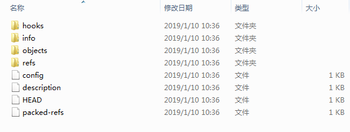

# 第二章 Git 常用命令

## 本章目标

这一章简要地带你了解一些最重要的 Git 命令。在这节中，我会向你介绍开始一个新的版本控制项目需要的所有工具，后面的几节包含了你每天都会用到的Git操作。

在这节之后，你应该能够创建一个新的 Git 仓库，缓存你的项目以免丢失，以及查看你项目的历史。

## git init

`git init` 命令创建一个新的 Git 仓库。它用来将已存在但还没有版本控制的项目转换成一个 Git 仓库，或者创建一个空的新仓库。大多数Git命令在未初始化的仓库中都是无法使用的，所以这就是你运行新项目的第一个命令了。

运行 `git init` 命令会在你项目的根目录下创建一个新的 `.git` 目录，其中包含了你项目必需的所有元数据。除了 `.git` 目录之外，已经存在的项目不会被改变（就像 SVN 一样，Git 不强制每个子目录中都有一个 `.git` 目录）。

### 用法

```shell
git init
```

将当前的目录转换成一个 Git 仓库。它在当前的目录下增加了一个 `.git` 目录，于是就可以开始记录项目版本了。

```shell
git init <directory>
```

在指定目录创建一个空的 Git 仓库。运行这个命令会创建一个名为 `directory`，只包含 `.git` 子目录的空目录。

```shell
git init --bare <directory>
```

初始化一个裸的 Git 仓库，但是忽略工作目录。共享的仓库应该总是用 `--bare` 标记创建（见下面的讨论）。一般来说，用 `—bare` 标记初始化的仓库以 `.git` 结尾。比如，一个叫`my-project`的仓库，它的空版本应该保存在 `my-project.git` 目录下。

### 讨论

和 SVN 相比，`git init` 命令是一个创建新的版本控制项目非常简单的途径。Git 不需要你创建仓库，导入文件，检查正在修改的拷贝。你只需要 `cd` 到你的项目目录下，运行 `git init`，你就有了一个功能强大的 Git 仓库。

但是，对大多数项目来说，`git init` 只需要在创建中央仓库时执行一次——开发者通常不会使用 `git init` 来创建他们的本地仓库。他们往往使用 `git clone` 来将已存在的仓库拷贝到他们的机器中去。

### 裸仓库

`-—bare` 标记创建了一个没有工作目录的仓库，这样我们在仓库中更改文件并且提交了。中央仓库应该总是创建成裸仓库，因为向非裸仓库推送分支有可能会覆盖已有的代码变动。将`-—bare`看成是用来将仓库标记为储存设施，而不是一个开发环境。也就是说，对于所有的 Git 工作流，中央仓库是裸仓库，开发者的本地仓库是非裸仓库。



### 例子

因为 `git clone` 创建项目的本地拷贝更为方便，`git init` 最常见的使用情景就是用于创建中央仓库：

```shell
ssh <user>@<host>

cd path/above/repo

git init --bare my-project.git
```

首先，你用SSH连入存放中央仓库的服务器。然后，来到任何你想存放项目的地方，最后，使用 `-—bare` 标记来创建一个中央存储仓库。开发者会将 `my-project.git` 克隆到本地的开发环境中。

## git clone

`git clone` 命令拷贝整个 Git 仓库。这个命令就像 `svn checkout` 一样，除了「工作副本」是一个完备的Git仓库——它包含自己的历史，管理自己的文件，以及环境和原仓库完全隔离。

为了方便起见，`clone` 自动创建了一个名为 `origin` 的远程连接，指向原有仓库。这让和中央仓库之间的交互更加简单。

### 用法

```shell
git clone <repo>
```

将位于 `<repo>` 的仓库克隆到本地机器。原仓库可以在本地文件系统中，或是通过 HTTP 或 SSH 连接的远程机器。

```shell
git clone <repo> <directory>
```

将位于 `<repo>` 的仓库克隆到本地机器上的 `<directory>` 目录。

### 讨论

如果项目在远程仓库已经设置完毕，`git clone` 是用户获取开发副本最常见的方式。和  `git init`相似，`clone` 通常也是一次性的操作——只要开发者获得了一份工作副本，所有版本控制操作和协作管理都是在本地仓库中完成的。

### 仓库间协作

- 这一点很重要，你要理解 Git 中「工作副本」的概念和 SVN 仓库 check out 下来的「工作副本」是很不一样的。和 SVN 不同的是，Git 不会区分工作副本和中央仓库——它们都是功能完备的 Git 仓库。

- 这就使得 Git 的协作和 SVN 截然不同。SVN 依赖于中央仓库和工作副本之间的关系，而 Git 协作模型是基于仓库和仓库之间的交互的。相对于 SVN 的提交流程，你可以在 Git 仓库之间 `push` 或 `pull` 提交。

### 例子

下面这个例子演示用 SSH 用户名 john 连接到 example.com，获取远程服务器上中央仓库的本地副本：

```shell
git clone ssh://john@example.com/path/to/my-project.git

cd my-project

# 开始工作
```

第一行命令在本地机器的 `my-project` 目录下初始化了一个新的 Git 仓库，并且导入了中央仓库中的文件。接下来，你 `cd` 到项目目录，开始编辑文件、缓存提交、和其它仓库交互。同时注意 `.git` 拓展名克隆时会被去除。它表明了本地副本的非裸状态。


## git config

`git config` 命令允许你在命令行中配置你的 Git 安装（或是一个独立仓库）。这个命令定义了所有配置，从用户信息到仓库行为等等。一些常见的配置命令如下所列。

### 用法

```shell
git config user.name <name>
```

定义当前仓库所有提交使用的作者姓名。通常来说，你希望使用 `--global` 标记设置当前用户的配置项。

```sh
git config --global user.name <name>
```

定义当前用户所有提交使用的作者姓名。

```sh
git config --global user.email <email>
```

定义当前用户所有提交使用的作者邮箱。

```sh
git config --global alias.<alias-name> <git-command>
```

为Git命令创建一个快捷方式（别名）。

```sh
git config --system core.editor <editor>
```

定义当前机器所有用户使用命令时用到的文本编辑器，如 `git commit`。`<editor>` 参数用编辑器的启动命令（如 vi）替代。

```sh
git config --global --edit
```

用文本编辑器打开全局配置文件，手动编辑。

### 讨论

所有配置项都储存在纯文本文件中，所以 `git config` 命令其实只是一个提供便捷的命令行接口。通常，你只需要在新机器上配置一次 Git 安装，以及，你通常会想要使用 `--global` 标记。

Git 将配置项保存在三个单独的文件中，允许你分别对单个仓库、用户和整个系统设置。

- <repo>/.git/config – 特定仓库的设置。

- ~/.gitconfig – 特定用户的设置。这也是 `--global` 标记的设置项存放的位置。

- $(prefix)/etc/gitconfig – 系统层面的设置。

当这些文件中的配置项冲突时，本地仓库设置覆盖用户设置，用户设置覆盖系统设置。如果你打开期中一份文件，你会看到下面这些：

```sh
[user]

name = John Smith

email = john@example.com

[alias]

st = status

co = checkout

br = branch

up = rebase

ci = commit

[core]

editor = vim
```

你可以用 `git config` 手动编辑这些值。

### 例子

你在安装 Git 之后想要做的第一件事是告诉它你的名字和邮箱，个性化一些默认设置。一般初始的设置过程看上去是这样的：

```sh
# 告诉Git你是谁

git config --global user.name "John Smith"

git config --global user.email john@example.com

# 选择你喜欢的文本编辑器

git config --global core.editor vim

# 添加一些快捷方式(别名)

git config --global alias.st status

git config --global alias.co checkout

git config --global alias.br branch

git config --global alias.up rebase

git config --global alias.ci commit
```

它会生成上一节中所说的 `~/.gitconfig` 文件。


## git status

`git status` 命令显示工作目录和缓存区的状态。你可以看到哪些更改被缓存了，哪些还没有，以及哪些还未被 Git 追踪。status 的输出 *不会* 告诉你任何已提交到项目历史的信息。如果你想看的话，应该使用 `git log` 命令。

### 用法

```
git status
```

列出已缓存、未缓存、未追踪的文件。

### 讨论

`git status` 是一个相对简单的命令。 它告诉你 `git add` 和 `git commit` 的进展。status 信息还包括了添加缓存和移除缓存的相关指令。样例输出显示了三类主要的 `git status` 输出：

```
# On branch master
# Changes to be committed:
# (use "git reset HEAD <file>..." to unstage)
#
#modified: hello.py
#
# Changes not staged for commit:
# (use "git add <file>..." to update what will be committed)
# (use "git checkout -- <file>..." to discard changes in working directory)
#
#modified: main.py
#
# Untracked files:
# (use "git add <file>..." to include in what will be committed)
#
#hello.pyc
```

### 忽略文件

未追踪的文件通常有两类。它们要么是项目新增但还未提交的文件，要么是像 `.pyc`、`.obj`、`.exe` 等编译后的二进制文件。显然前者应该出现在 `git status` 的输出中，而后者会让我们困惑究竟发生了什么。

因此，Git 允许你完全忽略这些文件，只需要将路径放在一个特定的 `.gitignore` 文件中。所有想要忽略的文件应该分别写在单独一行，`*` 字符用作通配符。比如，将下面这行加入项目根目录的`.gitignore`文件可以避免编译后的Python模块出现在`git status`中：

```
*.pyc
```

### 例子

在提交更改前检查仓库状态是一个良好的实践，这样你就不会不小心提交什么奇怪的东西。这个例子显示了缓存和提交快照前后的仓库状态：

```
# Edit hello.py
git status
# hello.py is listed under "Changes not staged for commit"
git add hello.py
git status
# hello.py is listed under "Changes to be committed"
git commit
git status
# nothing to commit (working directory clean)
```

第一个 status 的输出显示文件还未缓存。`git add` 操作会影响第二个 `git status`，最后的 status 输出告诉你已经没有可以提交的东西了——工作目录和最近的提交一致。一些 Git 命令（比如 `git merge`）需要工作目录整洁，以免意外覆盖更改。

## git log

- `git log` 命令显示已提交的快照。你可以列出项目历史，筛选，以及搜索特定更改。`git status` 允许你查看工作目录和缓存区，而 `git log` 只作用于提交的项目历史。
- log 输出可以有很多种自定义的方式，从简单地筛选提交，到用完全自定义的格式显示。其中一些最常用的 `git log` 配置如下所示。

### 用法

```
git log
```

使用默认格式显示完整地项目历史。如果输出超过一屏，你可以用 `空格键` 来滚动，按 `q` 退出。

```
git log -n <limit>
```

用 `<limit>` 限制提交的数量。比如 `git log -n 3` 只会显示 3 个提交。

```
git log --oneline
```

将每个提交压缩到一行。当你需要查看项目历史的上层情况时这会很有用。

```
git log --stat
```

除了 `git log` 信息之外，包含哪些文件被更改了，以及每个文件相对的增删行数。

```
git log -p
```

显示代表每个提交的一堆信息。显示每个提交全部的差异（diff），这也是项目历史中最详细的视图。

```
git log --author="<pattern>"
```

搜索特定作者的提交。`<pattern>` 可以是字符串或正则表达式。

```
git log --grep="<pattern>"
```

搜索提交信息匹配特定 `<pattern>` 的提交。`<pattern>` 可以是字符串或正则表达式。

```
git log <since>..<until>
```

只显示发生在 `<since>` 和 `<until>` 之间的提交。两个参数可以是提交 ID、分支名、`HEAD` 或是任何一种引用。

```
git log <file>
```

只显示包含特定文件的提交。查找特定文件的历史这样做会很方便。

```
git log --graph --decorate --oneline
```

还有一些有用的选项。`--graph` 标记会绘制一幅字符组成的图形，左边是提交，右边是提交信息。`--decorate` 标记会加上提交所在的分支名称和标签。`--oneline` 标记将提交信息显示在同一行，一目了然。

### 讨论

`git log` 命令是 Git 查看项目历史的基本工具。当你要寻找项目特定的一个版本或者弄明白合并功能分支时引入了哪些变化，你就会用到这个命令。

```
commit 3157ee3718e180a9476bf2e5cab8e3f1e78a73b7
Author: John Smith
```

大多数时候都很简单直接。但是，第一行需要解释下。`commit` 后面 40 个字的字符串是提交内容的 SHA-1 校验总和（checksum）。它有两个作用。一是保证提交的正确性——如果它被损坏了，提交会生成一个不同的校验总和。第二，它是提交唯一的标识 ID。

这个 ID 可以用于 `git log` 这样的命令中来引用具体的提交。比如，`git log 3157e..5ab91` 会显示所有ID在 `3157e` 和 `5ab91` 之间的提交。除了校验总和之外，分支名、HEAD 关键字也是常用的引用提交的方法。`HEAD` 总是指向当前的提交，无论是分支还是特定提交也好。

~字符用于表示提交的父节点的相对引用。比如，`3157e~1` 指向 `3157e` 前一个提交,`HEAD~3` 是当前提交的回溯3个节点的提交。

所有这些标识方法的背后都是为了让你对特定提交进行操作。`git log` 命令一般是这些交互的起点，因为它让你找到你想要的提交。

### 例子

*用法* 一节提供了 `git log` 很多的例子，但请记住，你可以将很多选项用在同一个命令中：

```
git log --author="John Smith" -p hello.py
```

这个命令会显示 `John Smith` 作者对 `hello.py` 文件所做的所有更改的差异比较（diff）。

..句法是比较分支很有用的工具。下面的例子显示了在 `some-feature` 分支而不在 `master` 分支的所有提交的概览。

```
git log --oneline master..some-feature
```


## git checkout

`git checkout` 这个命令有三个不同的作用：`检出文件`、`检出提交`和`检出分支`。在这一章中，我们只关心前两种用法。

检出提交会使工作目录和这个提交完全匹配。你可以用它来查看项目之前的状态，而不改变当前的状态。检出文件使你能够查看某个特定文件的旧版本，而工作目录中剩下的文件不变。

### 用法

```
git checkout master
```

回到 master 分支。分支会在下一节中讲到，而现在，你只需要将它视为回到项目「当前」状态的一种方式。

```
git checkout <commit> <file>
```

查看文件之前的版本。它将工作目录中的 `<file>` 文件变成 `<commit>` 中那个文件的拷贝，并将它加入缓存区。

```
git checkout <commit>
```

更新工作目录中的所有文件，使得和某个特定提交中的文件一致。你可以将提交的哈希字串，或是标签作为 `<commit>` 参数。这会使你处在分离 HEAD 的状态。

### 例子

#### 查看之前的版本

这个例子假定你开始了一个疯狂的实验，但你不确定你是否想要保留它。为了帮助你决定，你想看一看你开始实验之前的项目状态。首先，你需要找到你想要看的那个版本的 ID。

```
git log --oneline
```

假设你的项目历史看上去和下面一样：

```
b7119f2 继续做些丧心病狂的事
872fa7e 做些丧心病狂的事
a1e8fb5 对 hello.py 做了一些修改
435b61d 创建 hello.py
9773e52 初始导入
```

你可以这样使用 `git checkout` 来查看「对 hello.py 做了一些修改」这个提交：

```
git checkout a1e8fb5
```

这让你的工作目录和 `a1e8fb5` 提交所处的状态完全一致。你可以查看文件，编译项目，运行测试，甚至编辑文件而不需要考虑是否会影响项目的当前状态。你所做的一切 *都不会* 被保存到仓库中。为了继续开发，你需要回到你项目的「当前」状态：

```
git checkout master
```

这里假定了你默认在 master 分支上开发，我们会在以后的分支模型中详细讨论。

一旦你回到 master 分支之后，你可以使用 `git revert` 或 `git reset` 来回滚任何不想要的更改。

#### 检出文件

如果你只对某个文件感兴趣，你也可以用 `git checkout` 来获取它的一个旧版本。比如说，如果你只想从之前的提交中查看 `hello.py` 文件，你可以使用下面的命令：

```
git checkout a1e8fb5 hello.py
```

记住，和检出提交不同，这里 *确实* 会影响你项目的当前状态。旧的文件版本会显示为「需要提交的更改」，允许你回滚到文件之前的版本。如果你不想保留旧的版本，你可以用下面的命令检出到最近的版本：

## git revert

`git revert` 命令用来撤销一个已经提交的快照。但是，它是通过搞清楚如何撤销这个提交引入的更改，然后在最后加上一个撤销了更改的 *新* 提交，而不是从项目历史中移除这个提交。这避免了Git丢失项目历史，这一点对于你的版本历史和协作的可靠性来说是很重要的。

### 用法

```
git revert <commit>
```

生成一个撤消了 `<commit>` 引入的修改的新提交，然后应用到当前分支。

### 讨论

撤销（revert）应该用在你想要在项目历史中移除一整个提交的时候。比如说，你在追踪一个 bug，然后你发现它是由一个提交造成的，这时候撤销就很有用。与其说自己去修复它，然后提交一个新的快照，不如用 `git revert`，它帮你做了所有的事情。

### 撤销（revert）和重设（reset）对比

理解这一点很重要。`git revert` 回滚了「单独一个提交」，它没有移除后面的提交，然后回到项目之前的状态。在 Git 中，后者实际上被称为 `reset`，而不是 `revert`。

撤销和重设相比有两个重要的优点。首先，它不会改变项目历史，对那些已经发布到共享仓库的提交来说这是一个安全的操作。至于为什么改变共享的历史是危险的，请参阅 `git reset` 一节。

其次，`git revert` 可以针对历史中任何一个提交，而 `git reset` 只能从当前提交向前回溯。比如，你想用 `git reset` 重设一个旧的提交，你不得不移除那个提交后的所有提交，再移除那个提交，然后重新提交后面的所有提交。不用说，这并不是一个优雅的回滚方案。

### 例子

下面的这个例子是 `git revert` 一个简单的演示。它提交了一个快照，然后立即撤销这个操作。

```
# 编辑一些跟踪的文件

# 提交一份快照
git commit -m "Make some changes that will be undone"

# 撤销刚刚的提交
git revert HEAD
```

注意第四个提交在撤销后依然在项目历史中。`git revert` 在后面增加了一个提交来撤销修改，而不是删除它。 因此，第三和第五个提交表示同样的代码，而第四个提交依然在历史中，以备以后我们想要回到这个提交。

## git reset

如果说 `git revert` 是一个撤销更改安全的方式，你可以将 `git reset` 看做一个 *危险* 的方式。当你用 `git reset` 来重设更改时(提交不再被任何引用或引用日志所引用)，我们无法获得原来的样子——这个撤销是永远的。使用这个工具的时候务必要小心，因为这是少数几个可能会造成工作丢失的命令之一。

和 `git checkout` 一样，`git reset` 有很多种用法。它可以被用来移除提交快照，尽管它通常被用来撤销缓存区和工作目录的修改。不管是哪种情况，它应该只被用于 *本地* 修改——你永远不应该重设和其他开发者共享的快照。

### 用法

```
git reset <file>
```

从缓存区移除特定文件，但不改变工作目录。它会取消这个文件的缓存，而不覆盖任何更改。

```
git reset
```

重设缓冲区，匹配最近的一次提交，但工作目录不变。它会取消 *所有* 文件的缓存，而不会覆盖任何修改，给你了一个重设缓存快照的机会。

```
git reset --hard
```

重设缓冲区和工作目录，匹配最近的一次提交。除了取消缓存之外，`--hard` 标记告诉 Git 还要重写所有工作目录中的更改。换句话说：它清除了所有未提交的更改，所以在使用前确定你想扔掉你所有本地的开发。

```
git reset <commit>
```

将当前分支的末端移到 `<commit>`，将缓存区重设到这个提交，但不改变工作目录。所有 `<commit>` 之后的更改会保留在工作目录中，这允许你用更干净、原子性的快照重新提交项目历史。

```
git reset --hard <commit>
```

将当前分支的末端移到 `<commit>`，将缓存区和工作目录都重设到这个提交。它不仅清除了未提交的更改，同时还清除了 `<commit>` 之后的所有提交。

### 讨论

上面所有的调用都是用来移除仓库中的修改。没有 `--hard` 标记时 `git reset` 通过取消缓存或取消一系列的提交，然后重新构建提交来清理仓库。而加上 `--hard` 标记对于作了大死之后想要重头再来尤其方便。

撤销(revert)被设计为撤销 *公开* 的提交的安全方式，`git reset`被设计为重设 *本地* 更改。因为两个命令的目的不同，它们的实现也不一样：重设完全地移除了一堆更改，而撤销保留了原来的更改，用一个新的提交来实现撤销。

### 例子

#### 取消文件缓存

`git reset` 命令在准备缓存快照时经常被用到。下面的例子假设你有两个文件，`hello.py` 和 `main.py`它们已经被加入了仓库中。

```
# 编辑了hello.py和main.py

# 缓存了目录下所有文件
git add .

# 意识到hello.py和main.py中的修改
# 应该在不同的快照中提交

# 取消main.py缓存
git reset main.py

# 只提交hello.py
git commit -m "Make some changes to hello.py"

# 在另一份快照中提交main.py
git add main.py
git commit -m "Edit main.py"
```

如你所见，`git reset` 帮助你取消和这次提交无关的修改，让提交能够专注于某一特定的范围。

#### 移除本地修改

下面的这个例子显示了一个更高端的用法。它展示了你作了大死之后应该如何扔掉那几个更新。

```
# 创建一个叫`foo.py`的新文件，增加代码

# 提交到项目历史
git add foo.py
git commit -m "Start developing a crazy feature"

# 再次编辑`foo.py`，修改其他文件

# 提交另一份快照
git commit -a -m "Continue my crazy feature"

# 决定废弃这个功能，并删除相关的更改
git reset --hard HEAD~2
```

`git reset HEAD~2` 命令将当前分支向前倒退两个提交，相当于在项目历史中移除刚创建的这两个提交。记住，这种重设只能用在 *非公开* 的提交中。绝不要在将提交推送到共享仓库之后执行上面的操作。


## git add

`git add` 命令将工作目录中的变化添加到缓存区。它告诉 Git 你希望下一个提交中包含这个文件的更新。不过，`git add` 不会实际上并不会改变你的仓库。直到你运行 `git commit` ，更改都没有真正被记录。

使用这些命令的同时，你还需要 `git status` 来查看工作目录和缓存区的状态。

### 工作原理

`git add` 和 `git commit` 这两个命令组成了最基本的 Git 工作流。它们的作用是将项目的诸多版本记录到仓库历史中。不管使用哪种团队协作模型，每个 Git 用户都必须理解这两个命令。

一个项目的编写离不开这个基本模式：编辑、缓存和提交。首先，你在工作目录下编辑你的文件。当你想要备份当前的项目状态时，你使用 `git add` 缓存更改。当你觉得这个被缓存的副本已经就绪，你使用 `git commit` 将它提交到项目历史。`git reset` 命令用于撤销提交或被缓存的快照。

除了 `git add` 和 `git commit` 之外，`git push` 也是完整的 Git 协作流程中的重要一环。`git push` 用于将提交的更改发送到远端仓库。随后，其它团队成员也可以看到这些更改。

`git add` 命令和 `svn add` 不同。后者直接将**文件**添加到仓库中，而 `git add` 作用于更抽象的**更改**（更低一层）。也就是说，哪怕对于同一个文件，每次修改时你都需要使用 `git add` ，而 `svn add` 只需要使用一次。这听上去多此一举，但却使项目更易于管理。

### 缓存区

`git add` 命令最主要的作用是将工作目录中的更改添加到 Git 的缓存区。缓存区是 Git 特有的功能之一，如果你之前使用的是 SVN（甚至是更古老的 Mercurial），那你可得花点时间理解了。你可以把它理解成工作目录和项目历史中间的缓冲区。缓存区是 Git 三个树状文件结构之一，另外两个是工作目录和提交历史。

缓存允许你把紧密相关的几份更改合并成一份快照，而不是直接提交所有新的更改。也就是说你可以同时进行多个无关的更改，最后分成几次将相关更改添加到缓存区并提交。对于任何版本控制系统来说，保持提交的原子性非常重要，这有利于追踪 bug 以及用最小的代价撤销更改。

### 用法

```shell
git add <文件>
```

缓存 `<文件>` 中的更改，准备下次提交。

```shell
git add <目录>
```

缓存 `<目录>` 下的所有更改，准备下次提交。

```shell
git add -p
```

开始交互式的缓存。你可以将某个文件的其中一处更改加入到下次提交缓存。Git 会显示一系列更改，并等待用户命令。使用 `y` 缓存某一处更改，使用 `n` 忽略某一处更改，使用 `s` 将某一处分割成更小的几份，使用 `e` 手动编辑某一处更改，使用  `q` 退出编辑。

### 例子

对于新项目来说，`git add` 和 `svn import` 的作用类似。使用下面两个命令为当前目录创建首个提交：

```shell
git add .
git commit
```

项目设置好之后，新的文件可以通过路径传递给 `git add` 来添加到缓存区：

```shell
git add hello.py
git commit
```

上面的命令同样可以用于记录已有文件的更改。如前所述，Git 不会区分被缓存的更改来自新文件，还是仓库中已有的文件。


## git remote

`git remote` 命令允许你创建、查看和删除和其它仓库之间的连接。远程连接更像是书签，而不是直接跳转到其他仓库的链接。它用方便记住的别名引用不那么方便记住的 URL，而不是提供其他仓库的实时连接。

例如，下图显示了你的仓库和中央仓库以及另一个开发者仓库之间的远程连接。你可以向 Git 命令传递 origin 和 john 的别名来引用这些仓库，替代完整的 URL。

### 用法

```
git remote
```

列出你和其他仓库之间的远程连接。

```
git remote -v
```

和上个命令相同，但同时显示每个连接的 URL。

```
git remote add <name> <url>
```

创建一个新的远程仓库连接。在添加之后，你可以将 `<name>` 作为 `<url>` 便捷的别名在其他 Git 命令中使用。

```
git remote rm <name>
```

移除名为<name>的远程仓库的连接。

```
git remote rename <old-name> <new-name>
```

将远程连接从 `<old-name>` 重命名为 `<new-name>`。

### 讨论

Git 被设计为给每个开发者提供完全隔离的开发环境。也就是说信息并不是自动地在仓库之间传递。开发者需要手动将上游提交拉取到本地，或手动将本地提交推送到中央仓库中去。`git remote` 命令正是将 URL 传递给这些「共享」命令的快捷方式。

#### 名为 origin 的远程连接

当你用 `git clone` 克隆仓库时，它自动创建了一个名为 origin 的远程连接，指向被克隆的仓库。当开发者创建中央仓库的本地副本时非常有用，因为它提供了拉取上游更改和发布本地提交的快捷方式。这也是为什么大多数基于 Git 的项目将它们的中央仓库取名为 origin。

#### 仓库的 URL

Git 支持多种方式来引用一个远程仓库。其中两种最简单的方式便是 HTTP 和 SSH 协议。HTTP 是允许匿名、只读访问仓库的简易方式。比如：

```
http://host/path/to/repo.git
```

但是，直接将提交推送到一个 HTTP 地址一般是不可行的（你不太可能希望匿名用户也能随意推送）。如果希望对仓库进行读写，你需要使用 SSH 协议：

```
ssh://user@host/path/to/repo.git
```

你需要在托管的服务器上有一个有效的 SSH 账户，但不用麻烦了，Git 支持开箱即用的 SSH 认证连接。

### 例子

除了 origin 之外，添加你同事的仓库连接通常会带来一些便利。比如，如果你的同事 John 在 `dev.example.com/john.git` 上维护了一个公开的仓库，你可以这样添加连接：

```
git remote add john http://dev.example.com/john.git
```

通过这种方式访问每个开发者的仓库，中央仓库之外的协作变得可能。这给维护大项目的小团队带来了极大的便利。

## git fetch

`git fetch` 命令将提交从远程仓库导入到你的本地仓库。拉取下来的提交储存为远程分支，而不是我们一直使用的普通的本地分支。你因此可以在整合进你的项目副本之前查看更改。

### 用法

```
git fetch <remote>
```

拉取仓库中所有的分支。同时会从另一个仓库中下载所有需要的提交和文件。

```
git fetch <remote> <branch>
```

和上一个命令相同，但只拉取指定的分支。

### 讨论

当你希望查看其他人的工作进展时，你需要 fetch。fetch 下来的内容表示为一个远程分支，因此不会影响你的本地开发。这是一个安全的方式，在整合进你的本地仓库之前，检查那些提交。类似于 svn update，你可以看到中央仓库的历史进展如何，但它不会强制你将这些进展合并入你的仓库。

#### 远程分支

远程分支和本地分支一样，只不过它们代表这些提交来自于其他人的仓库。你可以像查看本地分支一样查看远程分支，但你会处于分离 HEAD 状态（就像查看旧的提交时一样）。你可以把它们视作只读的分支。如果想要查看远程分支，只需要向 `git branch` 命令传入 `-r` 参数。远程分支拥有 remote 的前缀，所以你不会将它们和本地分支混起来。比如，下面的代码片段显示了从 origin 拉取之后，你可能想要查看的分支：

```
git branch -r
# origin/master
# origin/develop
# origin/some-feature
```

同样，你可以用寻常的 `git checkout` 和 `git log` 命令来查看这些分支。如果你接受远程分支包含的更改，你可以使用 `git merge` 将它并入本地分支。所以，不像 SVN，同步你的本地仓库和远程仓库事实上是一个分两步的操作：先 fetch，然后 merge。`git pull` 命令是这个过程的快捷方式。

### 例子

这个例子回顾了同步本地和远程仓库 `master` 分支的常见工作流：

```
git fetch origin
```

它会显示会被下载的分支：

```
a1e8fb5..45e66a4 master -> origin/master
a1e8fb5..9e8ab1c develop -> origin/develop
* [new branch] some-feature -> origin/some-feature
```

在下图中，远程分支中的提交显示为方块，而不是圆圈。正如你所见，`git fetch` 让你看到了另一个仓库完整的分支结构。若想查看添加到上游 master 上的提交，你可以运行 `git log`，用 `origin/master` 过滤：

```
git log --oneline master..origin/master
```

用下面这些命令接受更改并并入你的本地 `master` 分支：

```
git checkout master
git log origin/master
```

我们可以使用 `git merge origin/master`：

```
git merge origin/master
```

origin/master 和 master 分支现在指向了同一个提交，你已经和上游的更新保持了同步。

## git pull

在基于 Git 的协作工作流中，将上游更改合并到你的本地仓库是一个常见的工作。我们已经知道应该使用 `git fetch`，然后是 `git merge`，但是 `git pull` 将这两个命令合二为一。

### 用法

```
git pull <remote>
```

拉取当前分支对应的远程副本中的更改，并立即并入本地副本。效果和 `git fetch` 后接 `git merge origin/.` 一致。

```
git pull --rebase <remote>
```

和上一个命令相同，但使用 `git rebase` 合并远程分支和本地分支，而不是使用 `git merge`。

### 讨论

你可以将 `git pull` 当做 Git 中对应 `svn update` 的命令。这是同步你本地仓库和上游更改的简单方式。下图揭示了 pull 过程中的每一步。

你认为你的仓库已经同步了，但 `git fetch` 发现 origin 中 `master` 的版本在上次检查后已经有了新进展。 接着 `git merge` 立即将 `remote master` 并入本地的分支。

#### 基于 Rebase 的 Pull

`--rebase` 标记可以用来保证线性的项目历史，防止合并提交（merge commits）的产生。很多开发者倾向于使用 rebase 而不是 merge，因为「我想要把我的更改放在其他人完成的工作之后」。在这种情况下，与普通的 `git pull` 相比而言，使用带有 `--rebase` 标记的 `git pull` 甚至更像 svn update。

事实上，使用 `--rebase` 的 pull 的工作流是如此普遍，以致于你可以直接在配置项中设置它：

```
git config --global branch.autosetuprebase always # In git < 1.7.9
git config --global pull.rebase true              # In git >= 1.7.9
```

在运行这个命令之后，所有的 `git pull` 命令将使用 `git rebase` 而不是 `git merge`。

### 例子

下面的例子演示了如何和一个中央仓库的 `master branch` 同步：

```
git checkout master
git pull --rebase origin
```

简单地将你本地的更改放到其他人已经提交的更改之后。

## git push

Push 是你将本地仓库中的提交转移到远程仓库中时要做的事。它和 `git fetch` 正好相反，fetch 将提交导入到本地分支，而 push 将提交导出到远程分支。它可以覆盖已有的更改，所以你需要小心使用。这些情况请见下面的讨论。

### 用法

```
git push <remote> <branch>
```

将指定的分支推送到 `<remote>` 上，包括所有需要的提交和提交对象。它会在目标仓库中创建一个本地分支。为了防止你覆盖已有的提交，如果会导致目标仓库非快速向前合并时，Git 不允许你 push。

```
git push <remote> --force
```

和上一个命令相同，但即使会导致非快速向前合并也强制推送。除非你确定你所做的事，否则不要使用 `--force` 标记。

```
git push <remote> --all
```

将所有本地分支推送到指定的远程仓库。

```
git push <remote> --tags
```

当你推送一个分支或是使用 `--all` 选项时，标签不会被自动推送上去。`--tags` 将你所有的本地标签推送到远程仓库中去。

### 讨论

`git push` 最常见的用法是将你的本地更改发布到中央仓库。在你积累了一些本地提交，准备和同事们共享时，你（可以）用交互式 rebase 来清理你的提交，然后推送到中央仓库去。

上图显示了当你本地的 master 分支进展超过了中央仓库的 `master` 分支，当你运行 `git push origin master` 发布更改时发生的事情。注意，`git push` 和在远程仓库内部运行 `git merge master` 事实上是一样的。

#### 强制推送

Git 为了防止你覆盖中央仓库的历史，会拒绝你会导致非快速向前合并的推送请求。所以，如果远程历史和你本地历史已经分叉，你需要将远程分支 pull 下来，在本地合并后再尝试推送。这和 SVN 让你在提交更改集合之前要和中央仓库同步是类似的。

`--force` 这个标记覆盖了这个行为，让远程仓库的分支符合你的本地分支，删除你上次 pull 之后可能的上游更改。只有当你意识到你刚刚共享的提交不正确，并用 `git commit --amend` 或者交互式 rebase 修复之后，你才需要用到强制推送。但是，你必须绝对确定在你使用 `--force` 标记前你的同事们都没有 pull 这些提交。

#### 只推送到裸仓库

此外，你只应该推送到那些用 `--bare` 标记初始化的仓库。因为推送会弄乱远程分支结构，很重要的一点是，永远不要推送到其他开发者的仓	库。但因为裸仓库没有工作目录，不会发生打断别人的开发之类的事情。

### 例子

下面的例子描述了将本地提交推送到中央仓库的一些标准做法。首先，确保你本地的 `master` 和中央仓库的副本是一致的，提前 fetch 中央仓库的副本并在上面 rebase。交互式 rebase 同样是共享之前清理提交的好机会。接下来，`git push` 命令将你本地 `master` 分支上的所有提交发送给中央仓库.

```
git checkout master
git fetch origin master
git rebase -i origin/master
# Squash commits, fix up commit messages etc.
git push origin master
```

因为我们已经确信本地的 `master` 分支是最新的，它应该导致快速向前的合并，`git push` 不应该抛出非快速向前之类的问题。