# 第三章 Git分支

## git branch

分支代表了一条独立的开发流水线。分支是我们在第二篇中讨论过的「编辑/缓存/提交」流程的抽象。你可以把它看作请求全新「工作目录、缓存区、项目历史」的一种方式。新的提交被存放在当前分支的历史中，导致了项目历史被 fork 了一份。

`git branch` 命令允许你创建、列出、重命名和删除分支。它不允许你切换分支或是将被 fork 的历史放回去。因此，`git branch` 和 `git checkout`、`git merge` 这两个命令通常紧密地结合在一起使用。

### 用法

```
git branch
```

列出仓库中所有分支。

```
git branch <branch>
```

创建一个名为 `<branch>` 的分支。*不会* 自动切换到那个分支去。

```
git branch -d <branch>
```

删除指定分支。这是一个安全的操作，Git 会阻止你删除包含未合并更改的分支。

```
git branch -D <branch>
```

强制删除指定分支，即使包含未合并更改。如果你希望永远删除某条开发线的所有提交，你应该用这个命令。

```
git branch -m <branch>
```

将当前分支命名为 `<branch>`。

### 讨论

在 Git 中，分支是你日常开发流程中的一部分。当你想要添加一个新的功能或是修复一个 bug 时——不管 bug 是大是小——你都应该新建一个分支来封装你的修改。这确保了不稳定的代码永远不会被提交到主代码库中，它同时给了你机会，在并入主分支前清理你 feature 分支的历史。

#### 分支的顶端

Git 分支背后的实现远比 SVN 的模型要轻量。与其在目录之间复制文件，Git 将分支存为指向提交的引用。换句话说，分支代表了一系列提交的 *顶端* ——而不是提交的 *容器* 。分支历史通过提交之间的关系来推断。

这使得 Git 的合并模型变成了动态的。SVN 中的合并是基于文件的，而Git 让你在更抽象的提交层面操作。事实上，你可以看到项目历史中的合并其实是将两个独立的提交历史连接起来。

### 例子

#### 创建分支

分支只是指向提交的 *指针* ，理解这一点很重要。当你创建一个分支是，Git 只需要创建一个新的指针——仓库不会受到任何影响。因此，如果你最开始有这样一个仓库：

接下来你用下面的命令创建了一个分支：

```
git branch crazy-experiment
```

仓库历史保持不变。你得到的是一个指向当前提交的新的指针：

注意，这只会 *创建* 一个新的分支。要开始在上面添加提交，你需要用 `git checkout` 来选中这个分支，然后使用标准的 `git add` 和 `git commit` 命令。

#### 删除分支

一旦你完成了分支上的工作，准备将它并入主代码库，你可以自由地删除这个分支，而不丢失项目历史：

```
git branch -d crazy-experiment
```

然后，如果分支还没有合并，下面的命令会产生一个错误信息：

```
error: The branch 'crazy-experiment' is not fully merged.
If you are sure you want to delete it, run 'git branch -D crazy-experiment'.
```

Git 保护你不会丢失这些提交的引用，或者说丢失访问整条开发线的入口。如果你 *真的* 想要删除这个分支（比如说这是一个失败的实验），你可以用大写的 `-D` 标记：

```
git branch -D crazy-experiment
```

它会删除这个分支，无视它的状态和警告，因此需谨慎使用。

## git checkout

`git checkout` 命令允许你切换用 `git branch` 创建的分支。查看一个分支会更新工作目录中的文件，以符合分支中的版本，它还告诉 Git 记录那个分支上的新提交。将它看作一个选中你正在进行的开发的一种方式。

在上一篇中，我们看到了如何用 `git checkout` 来查看旧的提交。「查看分支」和「将工作目录更新到选中的版本/修改」很类似；但是，新的更改 *会* 保存在项目历史中——这不是一个只读的操作。

### 用法

```
git checkout <existing-branch>
```

查看特定分支，分支应该已经通过 `git branch` 创建。这使得 `<existing-branch>` 成为当前的分支，并更新工作目录的版本。

```
git checkout -b <new-branch>
```

创建并查看 `<new-branch>`，`-b` 选项是一个方便的标记，告诉Git在运行 `git checkout <new-branch>` 之前运行 `git branch <new-branch>`。

```
git checkout -b <new-branch> <existing-branch>
```

和上一条相同，但将 `<existing-branch>` 作为新分支的基，而不是当前分支。

### 讨论

`git checkout` 和 `git branch` 是一对好基友。当你想要创建一个新功能时，你用 `git branch` 创建分支，然后用 `git checkout` 查看。你可以在一个仓库中用 `git checkout` 切换分支，同时开发几个功能。

每个功能专门一个分支对于传统 SVN 工作流来说是一个巨大的转变。这使得尝试新的实验超乎想象的简单，不用担心毁坏已有的功能，并且可以同时开发几个不相关的功能。另外，分支可以促进了不同的协作工作流。

### 例子

下面的例子演示了基本的 Git 分支流程。当你想要开发新功能时，你创建一个专门的分支，切换过去：

```
git branch new-feature
git checkout new-feature
```

接下来，你可以和以往一样提交新的快照：

```
# 编辑文件
git add <file>
git commit -m "Started work on a new feature"
# 周而复始…
```

这些操作都被记录在 `new-feature` 上，和 `master` 完全独立。你想添加多少提交就可以添加多少，不用关心你其它分支的修改。当你想要回到「主」代码库时，只要 check out 到 `master` 分支即可：

```
git checkout master
```

这个命令在你开始新的分支之前，告诉你仓库的状态。在这里，你可以选择并入完成的新功能，或者在你项目稳定的版本上继续工作。

## git merge

合并是 Git 将被 fork 的历史放回到一起的方式。`git merge` 命令允许你将 `git branch` 创建的多条分支合并成一个。

注意，下面所有命令将更改 *并入* 当前分支。当前分支会被更新，以响应合并操作，但目标分支完全不受影响。也就是说 `git merge` 经常和 `git checkout` 一起使用，选择当前分支，然后用 `git branch -d` 删除废弃的目标分支。

### 用法

```
git merge <branch>
```

将指定分支并入当前分支。Git 会决定使用哪种合并算法（下文讨论）。

```
git merge --no-ff <branch>
```

将指定分支并入当前分支，但 *总是* 生成一个合并提交（即使是快速向前合并）。这可以用来记录仓库中发生的所有合并。

### 讨论

一旦你在单独的分支上完成了功能的开发，重要的是将它放回主代码库。取决于你的仓库结构，Git 有几种不同的算法来完成合并：快速向前合并或者三路合并。

当当前分支顶端到目标分支路径是线性之时，我们可以采取 **快速向前合并** 。Git 只需要将当前分支顶端（快速向前地）移动到目标分支顶端，即可整合两个分支的历史，而不需要“真正”合并分支。它在效果上合并了历史，因为目标分支上的提交现在在当前分支可以访问到。比如，`some-feature` 到 `master` 分支的快速向前合并会是这样的：

但是，如果分支已经分叉了，那么就无法进行快速向前合并。当和目标分支之间的路径不是线性之时，Git 只能执行 **三路合并** 。三路合并使用一个专门的提交来合并两个分支的历史。这个术语取自这样一个事实，Git 使用 *三个* 提交来生成合并提交：两个分支顶端和它们共同的祖先。

但你可以选择使用哪一种合并策略时，很多开发者喜欢使用快速向前合并（搭配 rebase 使用）来合并微小的功能或者修复 bug，使用三路合并来整合长期运行的功能。后者导致的合并提交作为两个分支的连接标志。

#### 解决冲突

如果你尝试合并的两个分支同一个文件的同一个部分，Git 将无法决定使用哪个版本。当这种情况发生时，它会停在合并提交，让你手动解决这些冲突。

Git 的合并流程令人称赞的一点是，它使用我们熟悉的「编辑/缓存/提交」工作流来解决冲突。当你遇到合并冲突时，运行 `git status` 命令来查看哪些文件存在需要解决的冲突。比如，如果两个分支都修改了 `hello.py` 的同一处，你会看到下面的信息：

```
# On branch master
# Unmerged paths:
# (use "git add/rm ..." as appropriate to mark resolution)
#
# both modified: hello.py
#
```

接下来，你可以自己修复这个合并。当你准备结束合并时，你只需对冲突的文件运行 `git add` 告诉 Git 冲突已解决。然后，运行 `git commit` 生成一个合并提交。这和提交一个普通的快照有着完全相同的流程，也就是说，开发者能够轻而易举地管理他们的合并。

注意，提交冲突只会出现在三路合并中。在快速向前合并中，我们不可能出现冲突的更改。


## 图解Git

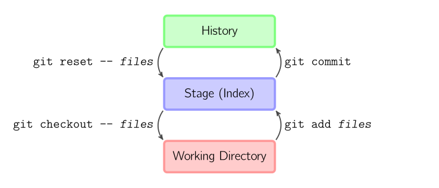

上面的四条命令在工作目录、stage 缓存(也叫做索引)和 commit 历史之间复制文件。

- `git add files` 把工作目录中的文件加入 stage 缓存
- `git commit` 把 stage 缓存生成一次 commit，并加入 commit 历史
- `git reset -- files` 撤销最后一次 `git add files`，你也可以用 `git reset` 撤销所有 stage 缓存文件
- `git checkout -- files` 把文件从 stage 缓存复制到工作目录，用来丢弃本地修改

你可以用 `git reset -p`、`git checkout -p` 或 `git add -p` 进入交互模式，也可以跳过 stage 缓存直接从  commit历史取出文件或者直接提交代码。


- `git commit -a ` 相当于运行 `git add` 把所有当前目录下的文件加入 stage 缓存再运行 `git commit`。
- `git commit files` 进行一次包含最后一次提交加上工作目录中文件快照的提交，并且文件被添加到 stage 缓存。
- `git checkout HEAD -- files` 回滚到复制最后一次提交。

## 约定

后文中以下面的形式使用图片：


绿色的5位字符表示提交的 ID，分别指向父节点。分支用橙色显示，分别指向特定的提交。当前分支由附在其上的 `_HEAD_` 标识。

这张图片里显示最后 5 次提交，`_ed489_` 是最新提交。 `_master_` 分支指向此次提交，另一个 `_maint_` 分支指向祖父提交节点。

## 命令详解

### Diff

有许多种方法查看两次提交之间的变动，下面是其中一些例子。

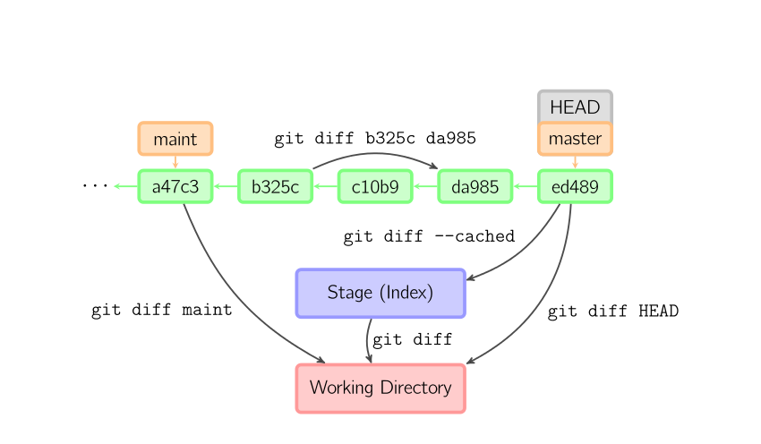

### Commit

提交时，Git 用 stage 缓存中的文件创建一个新的提交，并把此时的节点设为父节点。然后把当前分支指向新的提交节点。下图中，当前分支是 `_master_`。

在运行命令之前，`_master_` 指向 `_ed489_`，提交后，`_master_` 指向新的节点`_f0cec_` 并以 `_ed489_` 作为父节点。

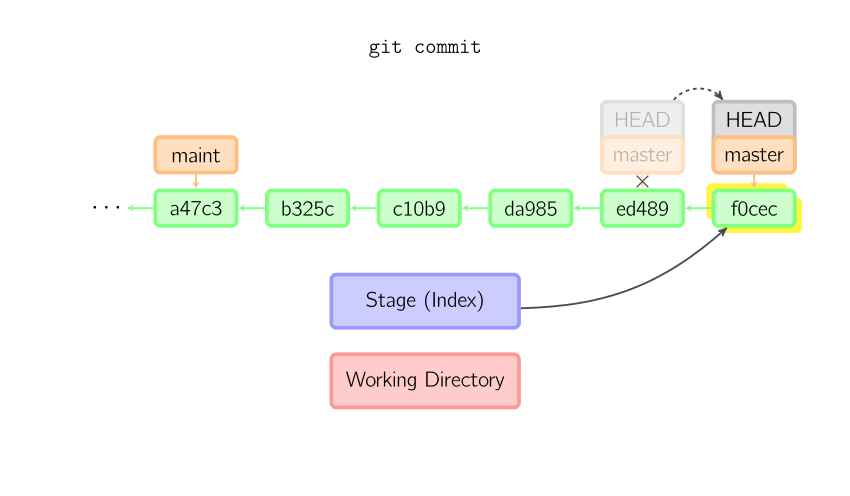

即便当前分支是某次提交的祖父节点，Git 会同样操作。下图中，在 `_master_` 分支的祖父节点 `_maint_` 分支进行一次提交，生成了 `_1800b_`。

这样，`_maint_ `分支就不再是 `_master_` 分支的祖父节点。此时，[merge](#merge) 或者 [rebase](#rebase) 是必须的。

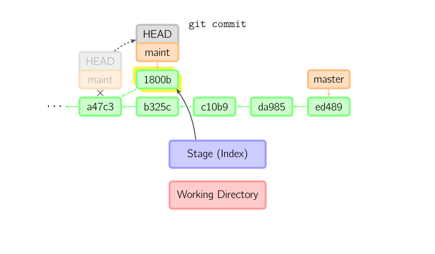

如果想更改一次提交，使用 `git commit --amend`。Git 会使用与当前提交相同的父节点进行一次新提交，旧的提交会被取消。

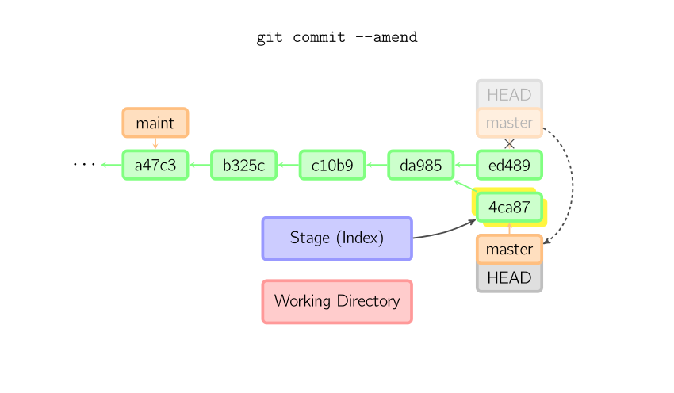

另一个例子是[分离HEAD提交](#detached)，在后面的章节中介绍。

### Checkout

`git checkout` 命令用于从历史提交（或者 stage 缓存）中拷贝文件到工作目录，也可用于切换分支。

当给定某个文件名（或者打开 `-p` 选项，或者文件名和-p选项同时打开）时，Git 会从指定的提交中拷贝文件到 stage 缓存和工作目录。比如，`git checkout HEAD~ foo.c` 会将提交节点 `_HEAD~_`（即当前提交节点的父节点）中的 `foo.c` 复制到工作目录并且加到 stage 缓存中。如果命令中没有指定提交节点，则会从 stage 缓存中拷贝内容。注意当前分支不会发生变化。

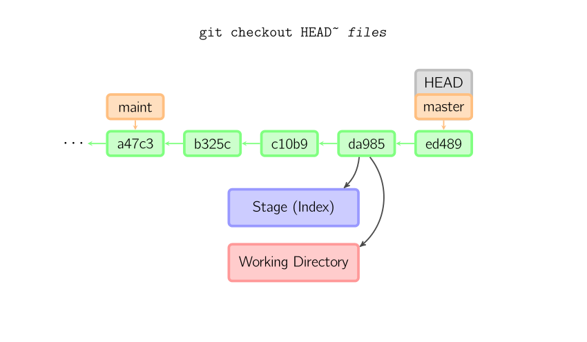

当不指定文件名，而是给出一个（本地）分支时，那么 `_HEAD_` 标识会移动到那个分支（也就是说，我们「切换」到那个分支了），然后 stage 缓存和工作目录中的内容会和 `_HEAD_` 对应的提交节点一致。新提交节点（下图中的 `a47c3`）中的所有文件都会被复制（到 stage 缓存和工作目录中）；只存在于老的提交节点（`ed489`）中的文件会被删除；不属于上述两者的文件会被忽略，不受影响。

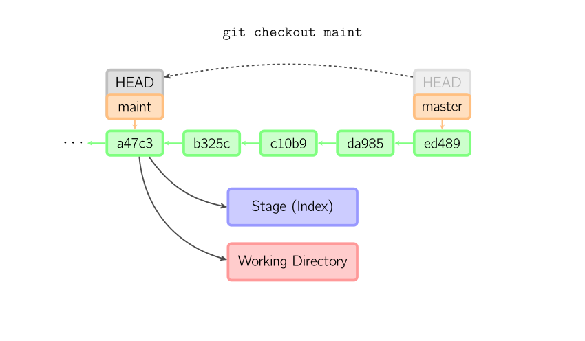

如果既没有指定文件名，也没有指定分支名，而是一个标签、远程分支、SHA-1 值或者是像 `_master~3_` 类似的东西，就得到一个匿名分支，称作 `_detached HEAD_`（被分离的 `_HEAD_` 标识）。这样可以很方便地在历史版本之间互相切换。比如说你想要编译 1.6.6.1 版本的 Git，你可以运行 `git checkout v1.6.6.1`（这是一个标签，而非分支名），编译，安装，然后切换回另一个分支，比如说 `git checkout master`。然而，当提交操作涉及到「分离的 HEAD」时，其行为会略有不同，详情见在[下面](#detached)。

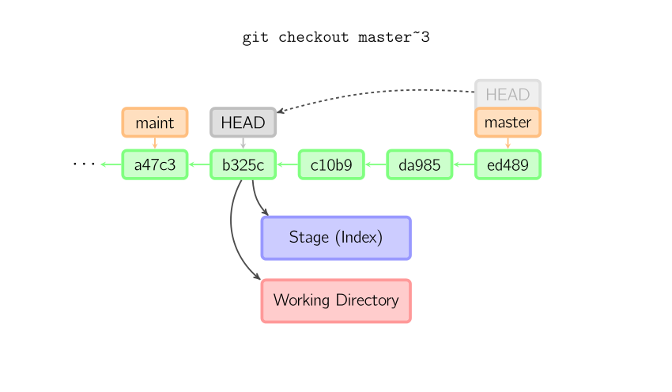

### HEAD 标识处于分离状态时的提交操作

当 `_HEAD_` 处于分离状态（不依附于任一分支）时，提交操作可以正常进行，但是不会更新任何已命名的分支。你可以认为这是在更新一个匿名分支。

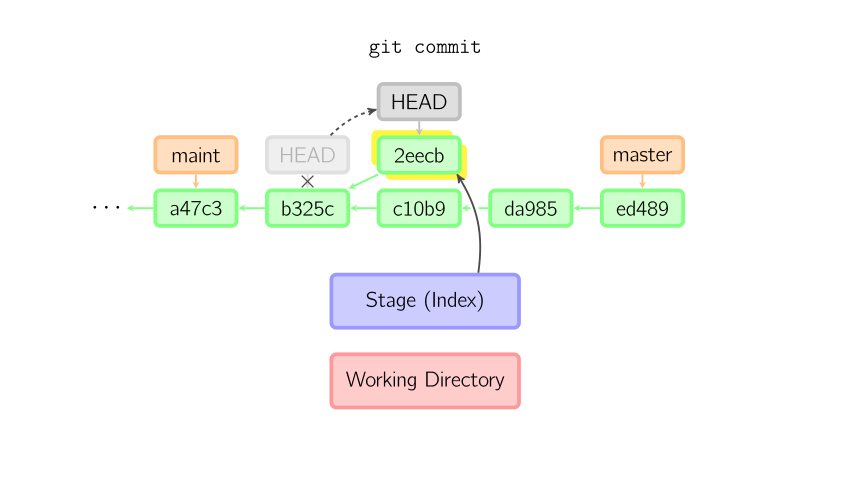

一旦此后你切换到别的分支，比如说 `_master_`，那么这个提交节点（可能）再也不会被引用到，然后就会被丢弃掉了。注意这个命令之后就不会有东西引用 `_2eecb_`。

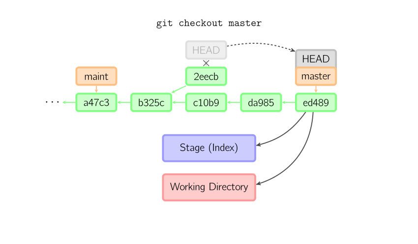

但是，如果你想保存这个状态，可以用命令 `git checkout -b name` 来创建一个新的分支。

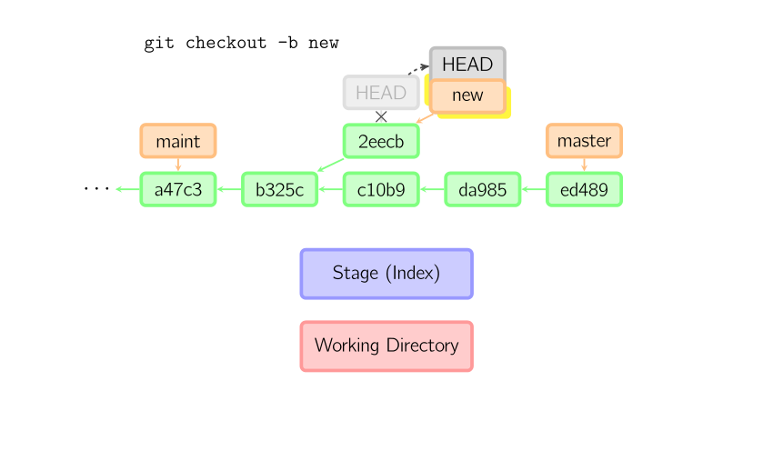

### Reset

`git reset` 命令把当前分支指向另一个位置，并且有选择的变动工作目录和索引。也用来在从历史commit历史中复制文件到索引，而不动工作目录。

如果不给选项，那么当前分支指向到那个提交。如果用 `--hard` 选项，那么工作目录也更新，如果用 `--soft` 选项，那么都不变。

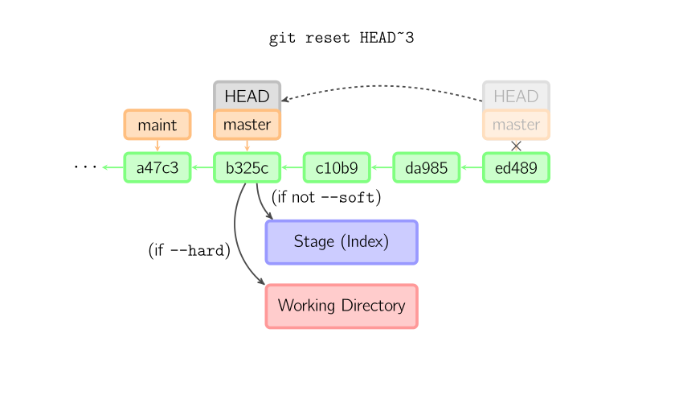

如果没有给出提交点的版本号，那么默认用 `_HEAD_`。这样，分支指向不变，但是索引会回滚到最后一次提交，如果用 `--hard` 选项，工作目录也同样。

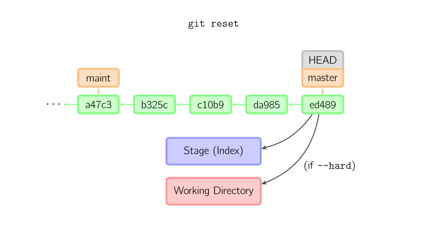

如果给了文件名(或者 `-p` 选项), 那么工作效果和带文件名的[checkout](#checkout)差不多，除了索引被更新。


### Merge

`git merge` 命令把不同分支合并起来。合并前，索引必须和当前提交相同。如果另一个分支是当前提交的祖父节点，那么合并命令将什么也不做。

另一种情况是如果当前提交是另一个分支的祖父节点，就导致 `_fast-forward_` 合并。指向只是简单的移动，并生成一个新的提交。

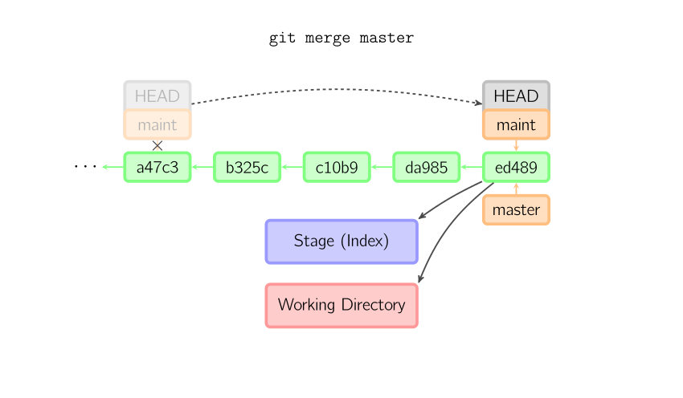

否则就是一次真正的合并。默认把当前提交（`_ed489_` 如下所示）和另一个提交（`_33104_`）以及他们的共同祖父节点（`_b325c_`）进行一次[三方合并](http://en.wikipedia.org/wiki/Three-way_merge)。结果是先保存当前目录和索引，然后和父节点 `_33104_` 一起做一次新提交。

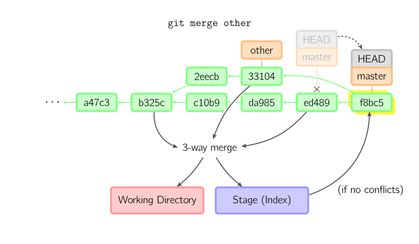