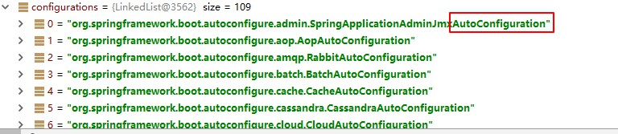
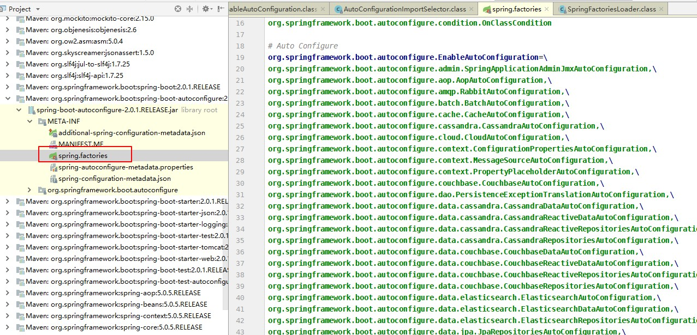

# 第一章 SpringBoot 快速入门

## Spring Boot简介 

- Spring Boot诞生于大数据微服务时代

- 设计理念：用来简化新Spring应用的初始搭建以及开发过程，约定大于配置，去繁从简

- 官网：https://spring.io/projects/spring-boot

  

## SpringBoot背景

- J2EE笨重的开发、繁多的配置、低下的开发效率、复杂的部署流程、第三方技术集成难度大。

- “Spring全家桶”时代。Spring Boot—>J2EE一站式解决方案Spring Cloud—>分布式整体解决方案

## Spring Boot特点 

- 创建独立的Spring应用程序
- 嵌入的Tomcat，无需部署WAR文件
- 简化Maven配置 
- 自动配置Spring
- 没有xml配置

## Spring Boot优缺点 

**缺点**

- 新技术坑多，文档较少 
- 入门容易深入难

**优点**

- 简化开发，简化配置，门槛低等
- 快速创建独立运行的Spring项目以及与主流框架集成
- 使用嵌入式的Servlet容器，应用无需打成WAR包
- starters自动依赖与版本控制
- 大量的自动配置，简化开发，也可修改默认值
- 无需配置XML，无代码生成，开箱即用
- 准生产环境的运行时应用监控
- 与云计算的天然集成

## 什么是微服务

- 微服务是一种架构风格，一个大型复杂软件应用由一个或多个微服务组成。系统中的各个微服务可被独立部署，各个微服务之间是松耦合的。每个微服务仅关注于完成一件任务并很好地完成该任务。在所有情况下，每个任务代表着一个小的业务能力。

- 微服务的概念源于2014年3月Martin Fowler所写的一篇文章“Microservices”(<http://martinfowler.com/articles/microservices.html>)。尽管“微服务”这种架构风格没有精确的定义，但其具有一些共同的特性，如围绕业务能力组织服务、自动化部署、智能端点、对语言及数据的“去集中化”控制等等。微服务架构的思考是从与整体应用对比而产生的。

  

- 对应用组件封装的方式是整体架构与微服务架构的主要差异，微服务架构将相关联的业务逻辑及数据放在一起形成独立的边界，其目的是能在不影响其他应用组件(微服务)的情况下更快地交付并推出市场。

  

## 为什么需要微服务架构

- 使用传统的整体式架构(Monolithic Architecture)应用开发系统，如CRM、ERP等大型应用，随着新需求的不断增加，企业更新和修复大型整体式应用变得越来越困难；
- 随着移动互联网的发展，企业被迫将其应用迁移至现代化UI界面架构以便能兼容移动设备，这要求企业能实现应用功能的快速上线；
- 许多企业在**SOA**（面向服务的架构是一个组件模型，它将应用程序的不同功能单元[称为服务]通过这些服务之间定义良好的接口和契约联系起来。 接口是采用中立的方式进行定义的，它应该独立于实现服务的硬件平台、操作系统和编程语言。）投资中得到的回报有限，SOA可以通过标准化服务接口实现能力的重用，但对于快速变化的需求，受到整体式应用的限制，有时候显得力不从心；
- 随着应用云化的日益普及，生于云端的应用具有与传统IT不同的技术基因和开发运维模式。此外，从技术方面看，云计算及互联网公司大量开源轻量级技术不停涌现并日渐成熟：互联网/内联网/网络更加成熟；
- 新的轻量级协议(RESTful API接口, 轻量级消息机制)；
- 服务平台化(PaaS)： 云服务平台上具有自动缩放、工作负载管理、SLA 管理、消息机制、缓存、构建管理等各种按需使用的服务；
- 新的可替代数据持久化模型：如NoSQL, MapReduce, BASE, CQRS等；
- 标准化代码管理：如Github等。

## 微服务架构的缺点

微服务的一些想法在实践上是好的，但当整体实现时也会呈现出其复杂性。

1. **运维开销及成本增加**：整体应用可能只需部署至一小片应用服务区集群，而微服务架构可能变成需要构建/测试/部署/运行数十个独立的服务，并可能需要支持多种语言和环境。这导致一个整体式系统如果由20个微服务组成，可能需要40~60个进程。
2. **必须有坚实的DevOps开发运维一体化技能**：开发人员需要熟知运维与投产环境，开发人员也需要掌握必要的数据存储技术如NoSQL，具有较强DevOps技能的人员比较稀缺，会带来招聘人才方面的挑战。
3. **隐式接口及接口匹配问题**：把系统分为多个协作组件后会产生新的接口，这意味着简单的交叉变化可能需要改变许多组件，并需协调一起发布。在实际环境中，一个新品发布可能被迫同时发布大量服务，由于集成点的大量增加，微服务架构会有更高的发布风险。
4. **代码重复**：某些底层功能需要被多个服务所用，为了避免将“同步耦合引入到系统中”，有时需要向不同服务添加一些代码，这就会导致代码重复。
5. **分布式系统的复杂性**：作为一种分布式系统，微服务引入了复杂性和其他若干问题，例如网络延迟、容错性、消息序列化、不可靠的网络、异步机制、版本化、差异化的工作负载等，开发人员需要考虑以上的分布式系统问题。
6. **异步机制**：微服务往往使用异步编程、消息与并行机制，如果应用存在跨微服务的事务性处理，其实现机制会变得复杂化。
7. **可测性的挑战**：在动态环境下服务间的交互会产生非常微妙的行为，难以可视化及全面测试。经典微服务往往不太重视测试，更多的是通过监控发现生产环境的异常，进而快速回滚或采取其他必要的行动。但对于特别在意风险规避监管或投产环境错误会产生显著影响的场景下需要特别注意。

## 环境准备

环境约束

- jdk1.8
- maven 3.x :maven3.3以上
- IDEA2017
- SpringBoot 1.5.9RELEASE

### 1、MAVEN设置

```xml
<!-- 配置JDK版本 -->
<profile>    
    <id>jdk18</id>    
    <activation>    
        <activeByDefault>true</activeByDefault>    
        <jdk>1.8</jdk>    
    </activation>    
    <properties>    
        <maven.compiler.source>1.8</maven.compiler.source>    
        <maven.compiler.target>1.8</maven.compiler.target>    
        <maven.compiler.compilerVersion>1.8</maven.compiler.compilerVersion>    
    </properties>     
</profile>
   <!-- 当 nexus-aliyun 下不了的包，或许这个镜像能下，
        才开放它，这个实在太慢，而且要把它放在首位，即 nexus-aliyun 之前，做过测试。
        所以它的用途只有那么一瞬间，就是或许它能下载，可以通过 url 去查找确定一下
    -->
    <!-- <mirror>
        <id>spring-libs-milestone</id>
        <mirrorOf>central</mirrorOf>
        <name>Spring Milestones</name>
        <url>http://repo.spring.io/libs-milestone</url>
    </mirror> -->

    <!-- nexus-aliyun 首选，放第一位,有不能下载的包，再去做其他镜像的选择  -->
    <mirror>
        <id>nexus-znsd</id>
        <mirrorOf>central</mirrorOf>
        <name>Nexus znsd</name>
        <url>http://nexus.znsd.com/content/groups/public</url>
    </mirror>
```

### 2、IDEA设置

    配置IDEA的Maven，指定Setting的Maven目录和MAVEN的setting.xml文件
    
    快捷键：
    
    Ctrl+D 复制一行
    
    Ctrl+Y 删除一行
    
    Ctrl+P 参数提示
    
    Ctrl+Alt+V 自动补齐方法
    
    Ctrl+N 查找类方法
    
    Alt+Ins 构造器、getter/setter toString
    
    Ctrl+O 重载方法提示
    
    Alt+Enter 提示导入类etc
    
    Shift+F6 :文件重命名

## Spring Boot的Hello World

### 1、创建一个Maven工程


### 2、导入Spring Boot的相关依赖

```xml
<parent>
    <groupId>org.springframework.boot</groupId>
    <artifactId>spring-boot-starter-parent</artifactId>
    <version>2.0.1.RELEASE</version>
    <relativePath/> <!-- lookup parent from repository -->
</parent>

<properties>
    <project.build.sourceEncoding>UTF-8</project.build.sourceEncoding>
    <project.reporting.outputEncoding>UTF-8</project.reporting.outputEncoding>
    <java.version>1.8</java.version>
</properties>

<dependencies>
    <dependency>
        <groupId>org.springframework.boot</groupId>
        <artifactId>spring-boot-starter-web</artifactId>
    </dependency>

    <dependency>
        <groupId>org.springframework.boot</groupId>
        <artifactId>spring-boot-starter-test</artifactId>
        <scope>test</scope>
    </dependency>
</dependencies>

```

### 3、编写个主程序

```java
@SpringBootApplication
public class SpringBoot01HelloQuickApplication {

    public static void main(String[] args) {
        SpringApplication.run(SpringBoot01HelloQuickApplication.class, args);
    }
}
```

### 4、编写相应的Controller和Service

```java
@Controller
public class HelloController {

    @ResponseBody
    @RequestMapping("/hello")
    public  String  hello(){
        return "hello world";
    }
}
```

### 5、运行主程序测试

访问 localhost:8080/hello

### 6、简化部署

在pom.xml文件中，导入build插件

```xml
<build>
    <plugins>
        <plugin>
            <groupId>org.springframework.boot</groupId>
            <artifactId>spring-boot-maven-plugin</artifactId>
        </plugin>
    </plugins>
</build>
```

## HelloWorld深度理解

### 1.POM.xml文件

#### 1、父项目

```xml
<parent>
    <groupId>org.springframework.boot</groupId>
    <artifactId>spring-boot-starter-parent</artifactId>
    <version>2.0.1.RELEASE</version>
    <relativePath/> <!-- lookup parent from repository -->
</parent>
```

这个父项目**spring-boot-starter-parent**又依赖一个父项目

```xml
<parent>
    <groupId>org.springframework.boot</groupId>
    <artifactId>spring-boot-dependencies</artifactId>
    <version>2.0.1.RELEASE</version>
    <relativePath>../../spring-boot-dependencies</relativePath>
</parent>
```

下面有个属性，定义了对应的版本号

```xml
<properties>
    <activemq.version>5.15.3</activemq.version>
    <antlr2.version>2.7.7</antlr2.version>
    <appengine-sdk.version>1.9.63</appengine-sdk.version>
    <artemis.version>2.4.0</artemis.version>
    <aspectj.version>1.8.13</aspectj.version>
    <assertj.version>3.9.1</assertj.version>
    <atomikos.version>4.0.6</atomikos.version>
    <bitronix.version>2.1.4</bitronix.version>
    <build-helper-maven-plugin.version>3.0.0</build-helper-maven-plugin.version>
```

Spring Boot的版本仲裁中心 会自动导入对应的版本，不需要我们自己导入依赖，没有dependencies里面管理的依赖自己声明

#### 2、启动器

```xml
<dependency>
    <groupId>org.springframework.boot</groupId>
    <artifactId>spring-boot-starter-web</artifactId>
</dependency>
```

**spring-boot-starter-web:**帮我们导入web模块正常运行所依赖的组件

**spring boot**将所有的功能场景都抽取出来，做成一个个的starter(启动器)，只需要在项目里引入这些starter相关场景的所有依赖都会被导入进来，要用什么功能就导入什么场景的启动器。

### 2、主程序入口

```java
@SpringBootApplication
public class SpringBoot01HelloQuickApplication {

    public static void main(String[] args) {
        SpringApplication.run(SpringBoot01HelloQuickApplication.class, args);
    }
}
```

**@SpringBootApplication:** 说明这个类是SpringBoot的主配置类，SpringBoot就应该运行这个类的main方法来启动应用

进入SpringBootApplication注解

```java
@Target({ElementType.TYPE})
@Retention(RetentionPolicy.RUNTIME)
@Documented
@Inherited
@SpringBootConfiguration
@EnableAutoConfiguration
@ComponentScan(
    excludeFilters = {@Filter(
    type = FilterType.CUSTOM,
    classes = {TypeExcludeFilter.class}
), @Filter(
    type = FilterType.CUSTOM,
    classes = {AutoConfigurationExcludeFilter.class}
)}
)
public @interface SpringBootApplication {
```

**@SpringBootConfiguration**：SpringBoot的配置类： 标准在某个类上，表示这是一个SpringBoot的配置类

**@Configuration**:配置类上，来标注这个注解；
配置类 ---- 配置文件，也是容器中的一个组件（@Component）
**@EnableAutoConfiguration**:开启自动配置功能
以前需要自动配置的东西，Spring Boot帮我们自动配置；@EnableAutoConfiguration告诉SpringBoot开启自动
配置功能；这样自动配置才能生效。 

```java
@AutoConfigurationPackage
@Import({AutoConfigurationImportSelector.class})
public @interface EnableAutoConfiguration { 
```

**@AutoConfigurationPackage**:自动配置包
**@Import({Registrar.class})**：底层注解，给容器导入组件；
将主配置类（@SpringBootApplication标注的类）的所在包及下面所有的子包里面的所有组件扫描到Spring容器； 

**@Import({AutoConfigurationImportSelector.class})：**
给容器导入组件？ 

AutoConfigurationImportSelector：导入组件选择器 

将所有需要导入的组件以及全类名的方式返回；这些组件将以字符串数组 String[] 添加到容器中；

会给容器非常多的自动配置类，（xxxAutoConfiguration）;就是给容器中导入这个场景需要的所有组件，并配置
好这些组件。 



```java
protected List<String> getCandidateConfigurations(AnnotationMetadata metadata,
AnnotationAttributes attributes) {
	List<String> configurations =
SpringFactoriesLoader.loadFactoryNames(this.getSpringFactoriesLoaderFactoryClass(),
this.getBeanClassLoader());
	Assert.notEmpty(configurations, "No auto configuration classes found in META‐INF/spring.factories. If you are using a custom packaging, make sure that file is correct.");
	return configurations;
} 
```

`SpringFactoriesLoader.loadFactoryNames(this.getSpringFactoriesLoaderFactoryClass(),`
`this.getBeanClassLoader());` 

Spring Boot在启动的时候从类路径下的META-INF/spring.factorys中获取的EnableAutoConfiguration指定的值；

将这些值作为自动配置类导入到容器中，自动配置就生效了。

J2EE的整体解决方案

org\springframework\boot\spring-boot-autoconfigure\2.0.1.RELEASE\spring-boot-autoconfigure-2.0.1.RELEASE.jar 

## 使用Spring Initializer创建一个快速向导 

1.IDE支持使用Spring Initializer

自己选择需要的组件:例如web

默认生成的SpringBoot项目 

- 主程序已经生成好了，我们只需要完成我们的逻辑


- resources文件夹目录结构

  - static:保存所有的静态文件；js css images

  - templates:保存所有的模板页面；（Spring Boot默认jar包使用嵌入式的Tomcat,默认不支持JSP）；可

    以使用模板引擎（freemarker.thymeleaf）;

  - application.properties:Spring Boot的默认配置，例如 server.port=9000 