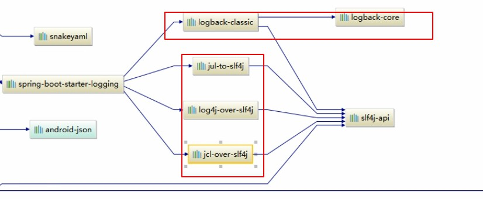

# 第三章 SpringBoot 日志

> Spring Boot2对日志有更改

### 1、日志框架

小张：开发一个大型系统；

1、System.out.println("");将关键数据打印在控制台；去掉？卸载文件中

2、框架记录系统的一些运行信息；日志框架zhanglog.jar

3、高大上功能，异步模式？自动归档？xxx?zhanglog-good.jar?

4、将以前的框架卸下来？换上新的框架，重新修改之前的相关API;zhanglog-perfect.jar;

5、JDBC--数据库驱动；

	写了一个统一的接口层；日志门面（日志的一个抽象层）；logging-abstract.jar;
	
	给项目中导入具体的日志实现就行；我们之前的日志框架都是实现的抽象层；

市面上的日志框架

| 日志抽象层                                                   | 日志实现                                        |
| ------------------------------------------------------------ | ----------------------------------------------- |
| ~~JCL(Jakarta Commons Logging)~~ SLF4j(Simple Logging Facade for Java) ~~jboss-logging~~ | Log4j ~~JUL(java.util.logging)~~ Log4j2 Logback |
|                                                              |                                                 |

左边的抽象，右边的实现

SLF4J  -- Logback

Spring Boot:底层是Spring框架，Spring默认框架是JCL；

	SpringBoot选用SLF4J和logback

### 2、SLF4J使用

#### 1、如何在系统中使用SLF4j

以后开发的时候，日志记录方法的调用，不应该来直接调用日志的实现类，而是调用日志抽象层里面的方法；

应该给系统里面导入slf4j的jar包和logback的实现jar

```java
import org.slf4j.Logger;
import org.slf4j.LoggerFactory;

public class HelloWorld {
  public static void main(String[] args) {
    Logger logger = LoggerFactory.getLogger(HelloWorld.class);
    logger.info("Hello World");
  }
}
```


每个日志框架的实现框架都有自己的配置文件。使用slf4j以后，**配置文件还是做成日志实现框架本身的配置文件**；

#### 2、遗留问题

a系统(slf4j+logback)：Spring（commons-logging）、Hibernate（jboss-logging）、Mybatis

统一日志框架，即使是别的框架和我一起统一使用slf4j进行输出；

核心：

1、将系统中其他日志框架排除出去；

2、用中间包来替换原有的日志框架/

3、导入slf4j的其他实现

### 3、SpingBoot日志框架解析

打开IDEA ，打开pom文件的依赖图形化显示


SpringBoot的基础框架

```xml
<dependency>
    <groupId>org.springframework.boot</groupId>
    <artifactId>spring-boot-starter-web</artifactId>
</dependency>
```

SpringBoot的日志功能

```xml
<dependency>
    <groupId>org.springframework.boot</groupId>
    <artifactId>spring-boot-starter-logging</artifactId>
    <version>2.0.1.RELEASE</version>
    <scope>compile</scope>
</dependency>
```




总结：

1. SpringBoot底层也是使用SLF4J+log4jback

2. SpringBoot也把其他日志替换成了slf4j

3. 起着commons.loggings的名字其实new的SLF4J替换中间包

   SpringBoot2中改成了bridge

4. 如果要引入其他框架？一定要把这个框架的日志依赖移除掉，而且底层

### 4、日志的使用

#### 1、默认配置

trace-debug-info-warn-error

可以调整需要的日志级别进行输出，不用注释语句。

```java
//记录器
Logger logger = LoggerFactory.getLogger(getClass());
@Test
public void contextLoads() {

    //日志的级别
    //从低到高
    //可以调整输出的日志级别；日志就只会在这个级别以后的高级别生效
    logger.trace("这是trace日志");
    logger.debug("这是debug信息");
    //SpringBoot默认给的是info级别，如果没指定就是默认的root级别
    logger.info("这是info日志");
    logger.warn("这是warn信息");
    logger.error("这是Error信息");
}
```

调整指定包的日志级别在配置文件中进行配置

```properties
logging.level.com.wdjr=trace
```

日志输出格式

```properties
#控制台输出的日志格式 
#%d：日期
#%thread：线程号 
#%-5level：靠左 级别 
#%logger{50}：全类名50字符限制,否则按照句号分割
#%msg：消息+换行
#%n：换行
logging.pattern.console=%d{yyyy-MM-dd HH:mm:ss.SSS} [%thread] %-5level %logger{50} - %msg%n
```

SpringBoot修改日志的默认配置

```properties
logging.level.com.wdjr=trace
#不指定path就是当前目录下生成springboot.log
#logging.file=springboot.log
#当前磁盘下根路径创建spring文件中log文件夹，使用spring.log作为默认
logging.path=/spring/log
#控制台输出的日志格式 日期 + 线程号 + 靠左 级别 +全类名50字符限制+消息+换行
logging.pattern.console=%d{yyyy-MM-dd HH:mm:ss.SSS} [%thread] %-5level %logger{50} - %msg%n
#指定文件中日志输出的格式
logging.pattern.file=xxx
```

#### 2、指定配置

给类路径下放上每个日志框架自己的配置框架；SpringBoot就不会使用自己默认的配置

| logging System         | Customization                                                |
| ---------------------- | ------------------------------------------------------------ |
| Logback                | logback-spring.xml ,logback-spring.groovy,logback.xml or logback.groovy |
| Log4J2                 | log4j2-spring.xml or log4j2.xml                              |
| JDK(Java Util Logging) | logging.properties                                           |

logback.xml直接被日志框架识别 ，logback-spring.xml日志框架就不直接加载日志配置项，由SpringBoot加载

```xml
<springProfile name="dev">
	<!-- 可以指定某段配置只在某个环境下生效 -->
</springProfile>
<springProfile name!="dev">
	<!-- 可以指定某段配置只在某个环境下生效 -->
</springProfile>
```

如何调试开发环境,输入命令行参数

--spring.profiles.active=dev

如果不带后面的xx-spring.xml就会报错

### 3、切换日志框架

可以根据slf4j的日志适配图，进行相关切换；

#### 1、log4j

slf4j+log4j的方式；


```xml
<dependency>
    <groupId>org.springframework.boot</groupId>
    <artifactId>spring-boot-starter-web</artifactId>
    <exclusions>
        <exclusion>
            <artifactId>logback-classic</artifactId>
            <groupId>ch.qos.logback</groupId>
        </exclusion>
    </exclusions>
</dependency>

<dependency>
    <groupId>org.slf4j</groupId>
    <artifactId>slf4j-log4j12</artifactId>
</dependency>
```

不推荐使用仅作为演示

#### 2、log4j2

切换为log4j2

```xml
<dependency>
    <groupId>org.springframework.boot</groupId>
    <artifactId>spring-boot-starter-web</artifactId>
    <exclusions>
        <exclusion>
            <artifactId>spring-boot-starter-logging</artifactId>
            <groupId>org.springframework.boot</groupId>
        </exclusion>
    </exclusions>
</dependency>
<dependency>
    <groupId>org.springframework.boot</groupId>
    <artifactId>spring-boot-starter-log4j2</artifactId>
</dependency>
```