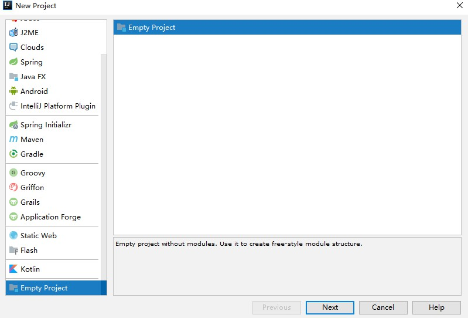
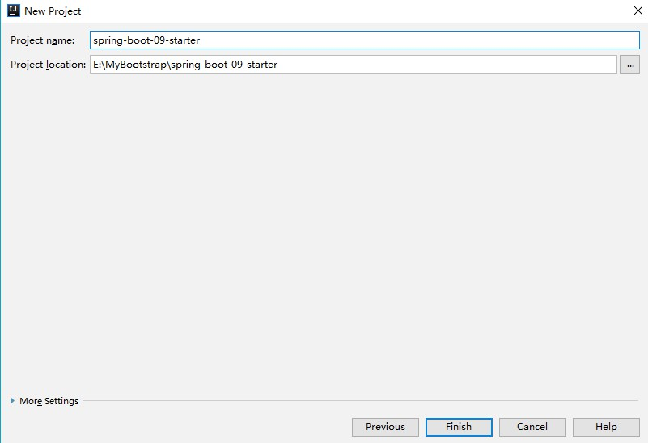
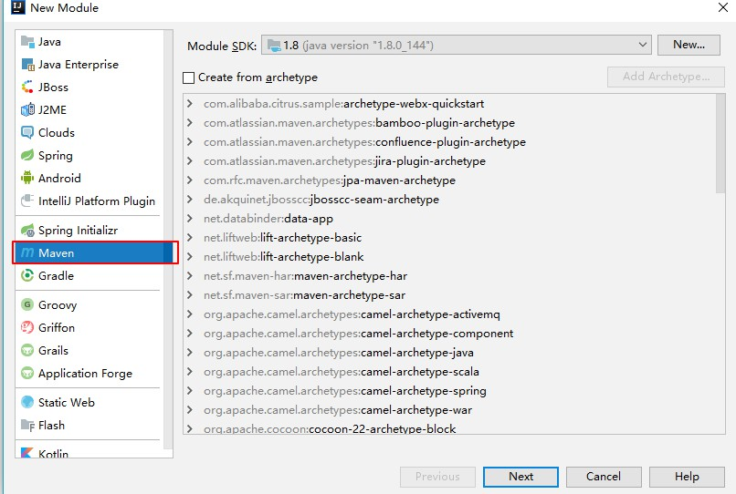
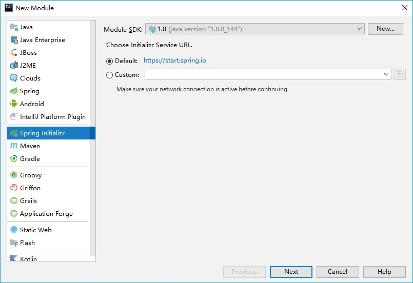
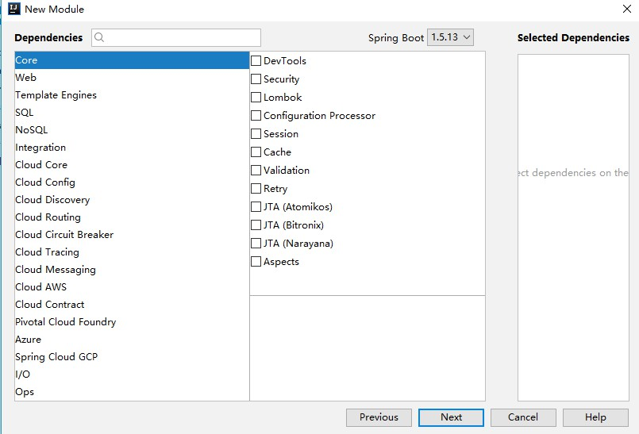
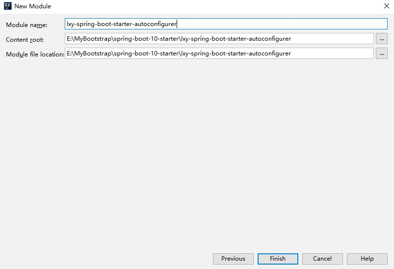
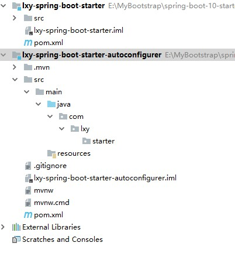
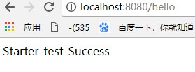

# 第五章 SpringBoot 启动配置原理

几个重要的事件回调机制

加载配置文件META-INF/spring.factories

	ApplicationContextInitializer
	
	SpringApplicationRunListener

ioc容器中

	ApplicationRunner
	
	CommandLineRunner

启动流程

## 1、创建SpringApplicaiotn对象   

```java
private void initialize(Object[] sources) {
    //保存主配置类
   if (sources != null && sources.length > 0) {
      this.sources.addAll(Arrays.asList(sources));
   }
    //判断当前是否是个web应用
   this.webEnvironment = deduceWebEnvironment();
    //从类路径下找到META-INF/spring.factories配置中的所有ApplicationInitializer 然后保存起来
   setInitializers((Collection) getSpringFactoriesInstances(
         ApplicationContextInitializer.class));
    //从类路径下找到META-INF/spring.factories配置中的所有ApplicationListener 然后保存起来
   setListeners((Collection) getSpringFactoriesInstances(ApplicationListener.class));
    //决定哪一个是主程序
   this.mainApplicationClass = deduceMainApplicationClass();
}
```

ApplicationInitializer


 ApplicationListener


## 2、运行Run方法

```java
public ConfigurableApplicationContext run(String... args) {
   StopWatch stopWatch = new StopWatch();
   stopWatch.start();
   ConfigurableApplicationContext context = null;
   FailureAnalyzers analyzers = null;
   configureHeadlessProperty();
    //获取SpringApplicationRunListeners;从类路径下META-INF/spring.factory
   SpringApplicationRunListeners listeners = getRunListeners(args);
    //回调所有的SpringApplicationRunListener.starting()方法
   listeners.starting();
   try {
       //封装命令行参数
      ApplicationArguments applicationArguments = new DefaultApplicationArguments(
            args);
       //准备环境
      ConfigurableEnvironment environment = prepareEnvironment(listeners,
            applicationArguments);
       //创建环境，完成后回调SpringApplicationRunListener.environmentPrepared环境准备完成
       //打印SpringBoot图标
      Banner printedBanner = printBanner(environment);
       //创建ApplicationContext，决定创建web的ioc容器还是普通的ioc
      context = createApplicationContext();
       //异常分析
      analyzers = new FailureAnalyzers(context);
       //重点：将environment保存的ioc中，applyInitializers初始化器上面那6个的获取，并且回调ApplicationContextInitializer.initialize方法
       
       //回调所有的SpringApplicationRunListener的contextPrepare()
       //告诉prepareContext运行完成以后回调所有的SpringApplicationRunListener的contextLoaded
      prepareContext(context, environment, listeners, applicationArguments,
            printedBanner);
       //重要：刷新所有组件 ioc容器初始化，如果是web应用还会创建嵌入式的tomcat
       //扫描 创建加载所有组件的地方
      refreshContext(context);
       //从ioc中获取所有的ApplicationRunner和CommandLineRunner
       //ApplicationRunner先回调
      afterRefresh(context, applicationArguments);
       //所有的SpringApplicationRunListener回调finished方法
      listeners.finished(context, null);
       //保存应用状态
      stopWatch.stop();
      if (this.logStartupInfo) {
         new StartupInfoLogger(this.mainApplicationClass)
               .logStarted(getApplicationLog(), stopWatch);
      }
       //整个springboot启动完成以后返回启动的ioc容器
      return context;
   }
   catch (Throwable ex) {
      handleRunFailure(context, listeners, analyzers, ex);
      throw new IllegalStateException(ex);
   }
}
```

## 3、事件监听机制

新建listener监听

文件目录


1、HelloApplicationContextInitializer

```java
//泛型监听ioc容器
public class HelloApplicationContextInitializer implements ApplicationContextInitializer<ConfigurableApplicationContext> {
    @Override
    public void initialize(ConfigurableApplicationContext applicationContext) {
        System.out.println("ApplicationContextInitializer...跑起来了....."+applicationContext);
    }
}
```

2、HelloSpringApplicationRunListener

加构造器

```java
public class HelloSpringApplicationRunListener implements SpringApplicationRunListener {

    public HelloSpringApplicationRunListener(SpringApplication application, String[] args){

    }

    @Override
    public void starting() {
        System.out.println("监听容器开始......");
    }

    @Override
    public void environmentPrepared(ConfigurableEnvironment environment) {
        System.out.println("环境准备好了......"+environment.getSystemProperties().get("os.name"));
    }

    @Override
    public void contextPrepared(ConfigurableApplicationContext context) {
        System.out.println("ioc容器准备好了......");
    }

    @Override
    public void contextLoaded(ConfigurableApplicationContext context) {
        System.out.println("容器环境已经加载完成......");
    }

    @Override
    public void finished(ConfigurableApplicationContext context, Throwable exception) {
        System.out.println("全部加载完成......");
    }
}
```

3、HelloApplicationRunner

```java
@Component
public class HelloApplicationRunner implements ApplicationRunner {
    @Override
    public void run(ApplicationArguments args) throws Exception {
        System.out.println("ApplicationRunner.....run....");
    }
}
```

4、HelloCommandLineRunner

```java
@Component
public class HelloCommandLineRunner implements CommandLineRunner {
    @Override
    public void run(String... args) throws Exception {
        System.out.println("CommandLineRunner......run....."+Arrays.asList(args));
    }
}
```

事件运行方法

HelloApplicationContextInitializer和HelloSpringApplicationRunListener文件META-INF/spring.factories中加入

```
# Initializers
org.springframework.context.ApplicationContextInitializer=\
com.wdjr.springboot.listener.HelloApplicationContextInitializer

org.springframework.boot.SpringApplicationRunListener=\
com.wdjr.springboot.listener.HelloSpringApplicationRunListener
```

HelloApplicationRunner和HelloCommandLineRunner ioc加入

@Component

# 八、SpringBoot的自定义starter

starter：场景启动器

1、场景需要使用什么依赖？

2、如何编写自动配置

```java
@Configuration //指定这个类是一个配置类
@ConditionalOnXXX //在指定条件下成立的情况下自动配置类生效
@AutoConfigureAfter //指定自动配置类的顺序
@Bean //给容器中添加组件

@ConfigurationProperties //结合相关xxxProperties类来绑定相关的配置
@EnableConfigurationProperties //让xxxProperties生效加到容器中

自动配置类要能加载
将需要启动就加载的自动配置类，配置在META-INF/spring.factories
# Auto Configure
org.springframework.boot.autoconfigure.EnableAutoConfiguration=\
org.springframework.boot.autoconfigure.admin.SpringApplicationAdminJmxAutoConfiguration,\
org.springframework.boot.autoconfigure.aop.AopAutoConfiguration,\
```

3、模式

启动器空的jar只需要做依赖管理导入；

专门写一个自动配置模块；

启动器依赖自动配置，别人只需要引入starter

xxx-spring-boot-starter

### 新建一个starter

> 绕的你怀疑人生

#### 1、新建一个空项目工程



2、项目命名




3、导入module


4、新建一个Maven工程



5、项目命名


6、在新建一个autoconfiguration类的spring



7、项目命名


8、无需导入依赖



9、next



最后配置完成

#### 2、编写starter

##### autoconfigurer

对**lxy-spring-boot-starter-autoconfigurer**进行删减

目录



2、pom文件修改

```xml
    <dependencies>
        <dependency>
            <groupId>org.springframework.boot</groupId>
            <artifactId>spring-boot-starter</artifactId>
        </dependency>

    </dependencies>


</project>
```

3、编写相关的类


4、HelloProperties

```java
package com.lxy.starter;


import org.springframework.boot.context.properties.ConfigurationProperties;

@ConfigurationProperties(prefix = "lxy.hello")
public class HelloProperties {
    private String prefix;
    private String suffix;

    public String getPrefix() {
        return prefix;
    }

    public void setPrefix(String prefix) {
        this.prefix = prefix;
    }

    public String getSuffix() {
        return suffix;
    }

    public void setSuffix(String suffix) {
        this.suffix = suffix;
    }
}
```

5、HelloService

```java
package com.lxy.starter;

public class HelloService {

    HelloProperties helloProperties;

    public HelloProperties getHelloProperties() {
        return helloProperties;
    }

    public void setHelloProperties(HelloProperties helloProperties) {
        this.helloProperties = helloProperties;
    }

    public String sayHello(String name){
        return helloProperties.getPrefix()+name+helloProperties.getSuffix();
    }
}
```

6、HelloServiceAutoConfiguration


```java
package com.lxy.starter;

import org.springframework.beans.factory.annotation.Autowired;
import org.springframework.boot.autoconfigure.condition.ConditionalOnWebApplication;
import org.springframework.boot.context.properties.EnableConfigurationProperties;
import org.springframework.context.annotation.Bean;
import org.springframework.context.annotation.Configuration;

@Configuration
@ConditionalOnWebApplication
@EnableConfigurationProperties(HelloProperties.class)
public class HelloServiceAutoConfiguration {

    @Autowired
    HelloProperties helloProperties;
    @Bean
    public HelloService helloService(){
        HelloService service = new HelloService();
        service.setHelloProperties(helloProperties);
        return service;
    }

}
```

7、配置文件

```
org.springframework.boot.autoconfigure.EnableAutoConfiguration=\
com.lxy.starter.HelloServiceAutoConfiguration
```

8、修改lxy-spring-boot-starter 也就是之前的Maven项目，修改pom文件引入autoconfiguration依赖

```xml
<dependencies>
    <dependency>
        <groupId>com.lxy.starter</groupId>
        <artifactId>lxy-spring-boot-starter-autoconfigurer</artifactId>
        <version>0.0.1-SNAPSHOT</version>
    </dependency>
</dependencies>
```

9、install生成


#### 3、测试

新建一个springboot 1.5+web

1、引入starter

```xml
    <dependency>
        <groupId>com.lxy.starter</groupId>
        <artifactId>lxy-spring-boot-starter</artifactId>
        <version>1.0-SNAPSHOT</version>
    </dependency>

</dependencies>
```

2、新建一个Controller用来测试

```java
@RestController
public class HelloController {

    @Autowired
    HelloService helloService;

    @GetMapping
    public  String hello(){
        return helloService.sayHello("test");
    }
}
```

3、编写配置文件制定前缀和后缀名

```properties
lxy.hello.prefix=Starter-
lxy.hello.suffix=-Success
```

4、运行访问http://localhost:8080/hello

