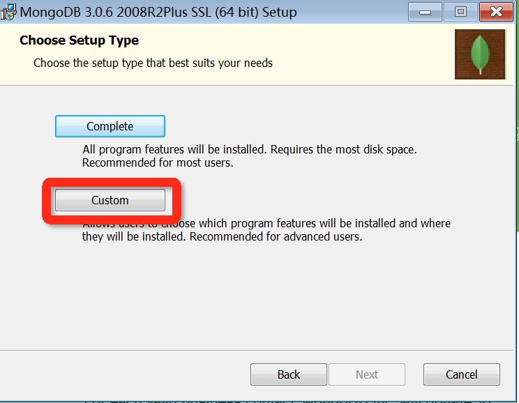

# MongoDB

​	 https://www.mongodb.com/

​	 由C++编写，旨在为WEB应用提供可扩展的高性能数据存储解决方案。

​	 是一个基于分布式文件存储的数据库。

​	 是一个介于关系型数据库与非关系型数据库之间的产品。

​	 NoSQL(Not Only SQL)数据库。


## MongoDB的特点

键值对的形式存储数据文档：

​		键用于唯一标识一个文档，为字符串类型，而值则可以是各种复杂的文件类型（BSON）

面向集合存储，易存储对象类型的数据：

​		数据被分组存储在数据集中，被称为一个集合（Collection)，类似于关系型数据库中的table

支持动态查询、索引：

​		可以在任意属性上建立索引，包含内部对象

支持复制和故障恢复：

​		MongoDB 支持主从复制机制，可以实现数据备份、故障恢复、读扩展等功能

使用二进制数据存储：

支持多种语言：

​		支持RUBY，PYTHON，JAVA，C++，PHP，C#等多种语言


## MongoDB的使用

##### 	下载地址：

​		https://www.mongodb.com/download-center#community

### 	Windows下安装：

安装MongoDB程序

### 	


##### 		创建数据库目录

​			创建数据库存放的目录：/data/db

##### 		运行MongoDB

​			进入DOS，到MongoDB安装目录的bin目录下执行：mongod -- dbpath ?:\data\db

​			如：

```
		C:\mongodb\bin\mongod --dbpath c:\data\db
```


##### 		配置MongoDB服务

​			创建mongodb服务配置文件：mongo.cfg

​			设置mongodb参数：

    systemLog:
    	destination: file
    	path: c:\data\log\mongod.log
    storage:
    	dbPath: c:\data\db
​			安装MongoDB服务，并指定配置文件：

​			如：DOS命令中：

```
"C:\mongodb\bin\mongod.exe" --config "C:\mongodb\mongod.cfg" --install
```

​			使用net命令启动、关闭MongoDB服务

```
启动服务：net start MongoDB
关闭服务：net stop MongoDB
移除服务："C:\mongodb\bin\mongod.exe" --remove
```


### 	Linux下安装：

##### 		下载：

```
curl -O https://fastdl.mongodb.org/linux/mongodb-linux-x86_64-3.0.6.tgz
```

##### 		解压：

```shell
tar -zxvf mongodb-linux-x86_64-3.0.6.tgz
```

​		将解压包拷贝到指定目录

```
mv  mongodb-linux-x86_64-3.0.6/ /usr/local/mongodb
```

##### 		配置path

​		在/etc/profile文件中添加path

```
export PATH=<mongodb-install-directory>/bin:$PATH
```

##### 		创建数据库目录

```
mkdir -p /data/db
/data/db 是 MongoDB 默认的启动的数据库路径(--dbpath)
```

##### 		运行 MongoDB 

```
$ ./mongod
```

##### 		MongoDB Shell

```
进入到安装的bin目录执行
./mongo
```


### 	MongoDB Shell

##### 	连接语法：

```
mongodb://[username:password@]host1[:port1][,host2[:port2],...[,hostN[:portN]]][/[database][?options]]
```

​	Shell中可以操作数据库，比如：查看由多少数据库：show dbs

​	创建数据库：use database_name

​	查询collection：db.collection_name.find();

​	插入数据到collection：db.collection_name.insert({"key_","value_"..........});


### 	MongoDB可视化工具

##### 	MongoVUE

​		MongoVUE是一个桌面GUI工具，专用于Windows平台，它有一个简洁、清爽的界面，它的基本功能是免费的

##### 	MongoHub

​		MongoHub是一个专用于Mac平台的MongoDB客户端GUI管理工具。它提供了通过SSH隧道连接到MongoDB服务器的方式，从安全角度来看非常便利

##### 	RockMongo

​		RockMongo是一个开源的、基于HTML的MongoDB GUI管理工具。它的GUI采用PHP语言编写。要运行此工具，需要自己搭建一个PHP服务器，再运行RockMongo应用

##### 	RoboMongo

​		RoboMongo是一个跨平台的MongoDB GUI客户端管理工具，支持Windows、MacOS、Linux


### 	MongoDB语法

##### 	数据库常用操作

​	创建数据库或切换数据库：

```
use DATABASE_NAME
```

​	查看所有数据库：

```
show dbs
```

​	删除数据库：

```
db.dropDatabase()
```

##### 集合操作

​	新增集合：

```
插入一个文档时，如果该collection不存在，自动创建
db.collection_name.insert({.....});
```

​	删除集合：

```
db.collection.drop()
```

##### 	文档操作

​		插入文档：

```
db.COLLECTION_NAME.insert({“key_”,"value_"})
db.COLLECTION_NAME.save(document)：save中指定id，则更改id，否则新插入一条数据
```

​		更新文档：

```
db.collection.update(
   <query>,--update的查询条件，类似sql update查询内where后面的
   <update>,-- update的对象和一些更新的操作符（如$,$inc...）等，也可以理解为sql update查询内set后面的
   {
     upsert: <boolean>,--可选，如果不存在update，是否插入objNew,true为插入，默认是false，不插入
     multi: <boolean>,--可选，默认false,只更新找到的第一条记录，如果这个参数为true,就把按条件查出来多条记录全部更新。
     writeConcern: <document>--可选，抛出异常的级别。
   }
)
```

​		删除文档：

```
db.collection.remove(
   <query>,
   {
     justOne: <boolean>,--（可选）如果设为 true 或 1，则只删除一个文档
     writeConcern: <document>
   }
)
```

​		查询文档：

```
语法：
db.collection.find(query, projection)；
query ：可选，使用查询操作符指定查询条件
	如：db.getCollection('student').find({"name":"loyal_3"})
projection：可选，使用投影操作符指定返回的键。查询时返回文档中所有键值， 只需省略该参数即可（默认省略）
	如：db.getCollection('student').find({},{name:0,sex:0})，0--不查询该字段，非0--查询该字段
```

​		查询条件运算符：

```
等于：{<key>:<value>}
	db.loyal.find({"abc":"456"})
小于：{<key>:{$lt:<value>}}
	db.loyal.find({"abc":{$lt:"457"}})
小于或等于：{<key>:{$lte:<value>}}
	db.loyal.find({"abc":{$lte:"457"}})
大于：{<key>:{$gt:<value>}}
	db.loyal.find({"abc":{$gt:"455"}})
大于或等于：{<key>:{$gte:<value>}}
	db.loyal.find({"abc":{$gte:"455"}})
不等于：{<key>:{$ne:<value>}}
	db.loyal.find({"abc":{$ne:"455"}})
	
```

​		AND 条件：

```
db.col.find({key1:value1, key2:value2}).pretty()；
find() 方法可以传入多个键(key)，每个键(key)以逗号隔开，即常规 SQL 的 AND 条件
```

​		OR 条件：

```
db.col.find(
   {
      $or: [
         {key1: value1}, {key2:value2}
      ]
   }
).pretty()；
OR 条件语句使用了关键字 $or
```

​		$type 操作符：

​		$type操作符是基于BSON类型来检索集合中匹配的数据类型，并返回匹配的结果

```
$type 类型对应表：
Double	1	 
String	2	 
Object	3	 
Array	4	 
Binary data	5	 
Undefined	6	
Object id	7	 
Boolean	8	 
Date	9	 
Null	10	 
Regular Expression	11	 
JavaScript	13	 
Symbol	14	 
JavaScript (with scope)	15	 
32-bit integer	16	 
Timestamp	17	 
64-bit integer	18	 
Min key	255	
Max key	127	 

如：
db.col.find({"title" : {$type : 2}})；
表示查询title的值是String类型的文档
```

​		Limit与Skip方法：

limit()：

​	读取指定数量的数据记录;limit()方法接受一个数字参数，该参数指定从MongoDB中读取的记录条数

```
db.COLLECTION_NAME.find().limit(NUMBER)
如：
db.loyal.find({"abc":{$ne:"455"}}).limit(1)；--只查询一条数据
```

Skip()：

​	跳过指定数量的数据;接受一个数字参数作为跳过的记录条数

```
db.COLLECTION_NAME.find().limit(NUMBER).skip(NUMBER)
如：
db.loyal.find({"abc":{$ne:"455"}}).limit(1).skip(1)；--查询第二条数据，limit与skip连用先执行skip
```

​		排序:

```
db.COLLECTION_NAME.find().sort({KEY:1})
--key:字段名
--1：升序，-1降序
```

​		索引：

```
db.COLLECTION_NAME.ensureIndex({KEY:1})；--KEY：字段名，1或-1表示升序或降序
其它可选参数：
如：
db.collection_name.ensureIndex({key1: 1}, {background: true});

background	Boolean	建索引过程会阻塞其它数据库操作，background可指定以后台方式创建索引，即增加 "background" 可选参数。 "background" 默认值为false。
unique	Boolean	建立的索引是否唯一。指定为true创建唯一索引。默认值为false.
name	string	索引的名称。如果未指定，MongoDB的通过连接索引的字段名和排序顺序生成一个索引名称。
dropDups	Boolean	在建立唯一索引时是否删除重复记录,指定 true 创建唯一索引。默认值为 false.
sparse	Boolean	对文档中不存在的字段数据不启用索引；这个参数需要特别注意，如果设置为true的话，在索引字段中不会查询出不包含对应字段的文档.。默认值为 false.
expireAfterSeconds	integer	指定一个以秒为单位的数值，完成 TTL设定，设定集合的生存时间。
v	index version	索引的版本号。默认的索引版本取决于mongod创建索引时运行的版本。
weights	document	索引权重值，数值在 1 到 99,999 之间，表示该索引相对于其他索引字段的得分权重。
default_language	string	对于文本索引，该参数决定了停用词及词干和词器的规则的列表。 默认为英语
language_override	string	对于文本索引，该参数指定了包含在文档中的字段名，语言覆盖默认的language，默认值为 language.
```

​		聚合(aggregate)：

```
db.COLLECTION_NAME.aggregate(AGGREGATE_OPERATION)；
AGGREGATE_OPERATION=聚合管道+表达式；
db.loyal.aggregate([{ 聚合管道类型：{ 结果集的列名：“$聚合的列”，表达式结果的列名：{表达式：“$表达式处理的列”} }   }])；
如：
db.loyal.aggregate([{
    $group:{_id:"$abc",count_num:{$sum:"$abc"}}
    }])；
 聚合管道：
$project：修改输入文档的结构。可以用来重命名、增加或删除域，也可以用于创建计算结果以及嵌套文档。
$match：用于过滤数据，只输出符合条件的文档。$match使用MongoDB的标准查询操作。
$limit：用来限制MongoDB聚合管道返回的文档数。
$skip：在聚合管道中跳过指定数量的文档，并返回余下的文档。
$unwind：将文档中的某一个数组类型字段拆分成多条，每条包含数组中的一个值。
$group：将集合中的文档分组，可用于统计结果。
$sort：将输入文档排序后输出。
$geoNear：输出接近某一地理位置的有序文档

表达式：
$sum	计算总和。	
	db.loyal.aggregate([{
    $group:{_id:"$abc",count_num:{$sum:"$abc"}}
    }])；
$avg	计算平均值
$min	获取集合中所有文档对应值得最小值。
$max	获取集合中所有文档对应值得最大值。	
$push	在结果文档中插入值到一个数组中。
$addToSet	在结果文档中插入值到一个数组中，但不创建副本。	
$first	根据资源文档的排序获取第一个文档数据
$last	根据资源文档的排序获取最后一个文档数据	
```


### 复制（副本集）

​	MongoDB分布式存储数据，通过复制将数据存储到多台服务器上（存储多个副本）。

##### 		特性：

- N 个节点的集群

- 数据高可用性 (24*7)

- 任何节点可作为主节点

- 所有写入操作都在主节点上

- 自动故障转移

- 自动恢复
  ##### 原理：

  mongodb的复制至少需要两个节点。其中一个是主节点，负责处理客户端请求，其余的都是从节点，负责复制主节点上的数据

  

  ##### 设置：

  ```
  mongod --port "PORT" --dbpath "YOUR_DB_DATA_PATH" --replSet "REPLICA_SET_INSTANCE_NAME"；
  如：
  mongod --port 27017 --dbpath "D:\set up\mongodb\data" --replSet rs0
  启动一个名为rs0的MongoDB实例
  
  添加副本集：
  rs.add(HOST_NAME:PORT)
  ```

  ```
  同台MongoDB服务器上实现主从：
  1：将安装目录复制到不同的磁盘中，即bin的上级目录整个copy至另外的磁盘目录中。
  2：为副本集创建/data/db，数据库目录
  3：启动主服务器：
  	如：c盘中的mongodb做为主服务器，进入bin目录，dos中执行：
  	mongod -- master
  4:启动从服务器：
  	如：copy至d盘的安装目录为从服务器，进入D盘的安装目录/bin中dos执行：
  	mongod --dbpath=D:\data\db --port 27018 --slave --source=127.0.0.1:27017
  ```

##### Centos下主从复制

* 安装Mongodb

  * 将压缩包复制至Linux，并解压

    * tar -zxvf mongodb-linux-x86_64-rhel62-3.4.10.tgz

  * 解压后，将文件夹名修改为mongodb，并将mongodb文件移到/usr/local目录下

    * mv mongodb-linux-x86_64-rhel62-3.4.10 mongodb
    * mv mongodb /usr/local/

  * 在/usr/local/mongodb目录下创建data/db目录及log目录，存放数据及日志

    * mkdir data
    * mkdir log
      * cd log
      * touch mongodb.log
    * cd data
    * mkdir db

  * 在data目录下创建mongodb启动的配置文件mongodb.conf

    * vim mongodb.conf

      ``` 
      #数据存放目录
      dbpath=/usr/local/mongodb/data/db
      #日志存放目录
      logpath=/usr/local/mongodb/data/log/mongodb.log
      #主服务
      master=true
      #后台运行mongodb
      fork=true
      #端口号
      port=27017
      #同步日志的大小
      oplogSize=2048
      #是否开启认证，用户登录
      #auth = true
      ```

  * 设置启动mongodb的环境变量

    * vim /etc/profile 

    * 在profile文件中加入：

      ```
      export PATH=/usr/local/mongodb/bin:$PATH
      ```

    * source /etc/profile 使环境变量配置生效

  * 启动主服务

    * mongod --config /usr/local/mongodb/data/mongodb.conf

* 安装从服务器，在另一台Linux中安装mongodb，在配置mongodb.conf文件时有所不同，其它步骤都一样

  ```
  #数据存放目录
  dbpath=/usr/local/mongodb/data/db
  #日志存放目录
  logpath=/usr/local/mongodb/data/log/mongodb.log
  #从服务
  slave=true
  #同步地址，主服务所在IP地址
  source=192.168.108.130:27017
  #后台运行mongodb
  fork=true
  #端口号
  port=27017
  #同步日志的大小
  oplogSize=2048  
  #是否开启认证，用户登录
  #auth = true 
  ```

* 主库中修改数据，在从库中查看。

  * 从库中查看数据需要执行 rs.rlaveOk() 命令：允许在从服务器上进行操作


### spring整合

​	引入jar包：

​	spring版本为：4.0.2.RELEASE

```
<dependency>
      <groupId>org.springframework.data</groupId>
      <artifactId>spring-data-mongodb</artifactId>
      <version>1.1.0.RELEASE</version>
  </dependency>
  <dependency>
      <groupId>org.mongodb</groupId>
      <artifactId>mongo-java-driver</artifactId>
      <version>2.10.1</version>
  </dependency>
  <dependency>
      <groupId>org.springframework.data</groupId>
      <artifactId>spring-data-commons-core</artifactId>
      <version>1.4.0.RELEASE</version>
  </dependency>
```

​	spring中配置：

```
配置服务器：
	<mongo:mongo host="127.0.0.1" port="27017" />
mongo工厂：通过它来取得mongo实例,dbname为mongodb的数据库名，没有的话会自动创建
	<mongo:db-factory id="mongoDbFactory" dbname="student" />
mongodb操作模板：所有对mongodb的增删改查的操作都是通过它完成
	<bean id="mongoTemplate" class="org.springframework.data.mongodb.core.MongoTemplate">  
        <constructor-arg name="mongoDbFactory" ref="mongoDbFactory" />  
    </bean>
bean与Collection的转换器：扫描back-package目录下的文件，根据注释，把它们作为collection的映射 
	<mongo:mapping-converter base-package="com.lxit.mongo.bean" />
	
```

​	代码中使用：

```
@Repository
public class StudentDaoImpl implements StudentDao{
	
	@Autowired
	private MongoTemplate mongoTemplate;

	@Override
	public boolean add(Student stu) {
		mongoTemplate.insert(stu);
		return true;
	}

	@Override
	public Student getStu(int id) {
		Query query = new Query();
		query.addCriteria(new Criteria("id").is(id));
		List<Student> stuList = mongoTemplate.find(query , Student.class);
		if(null != stuList && !stuList.isEmpty()){
			return stuList.get(0);
		}
		return null;
	}
}
```

