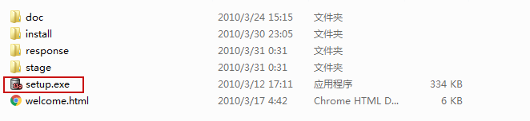
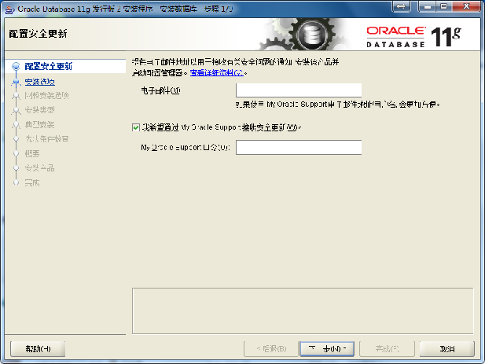
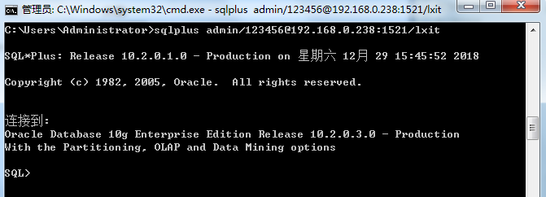
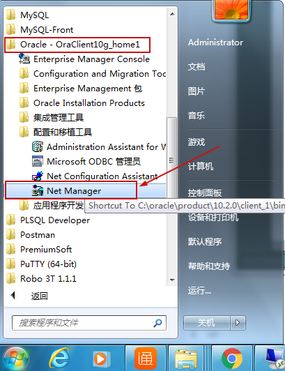
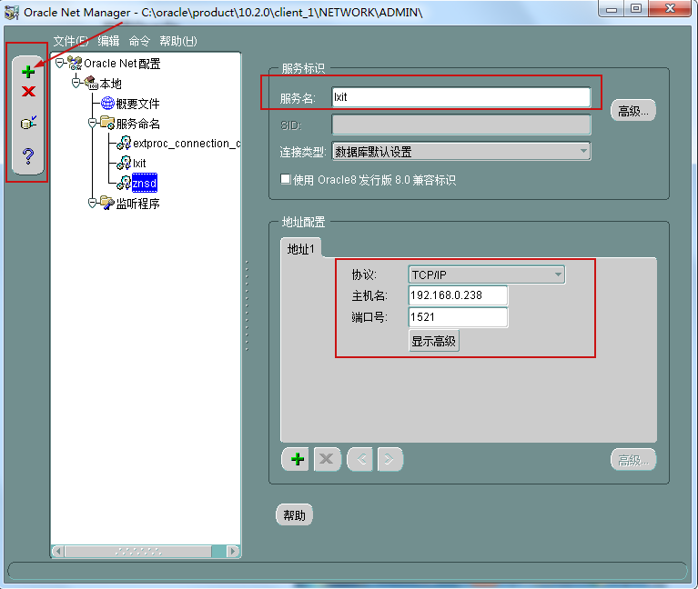
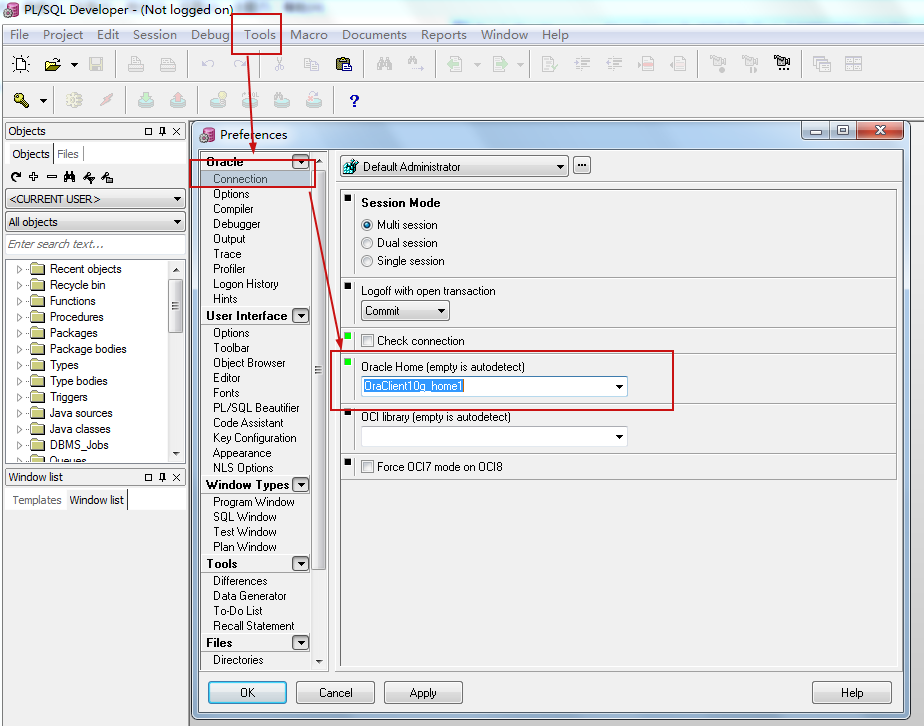
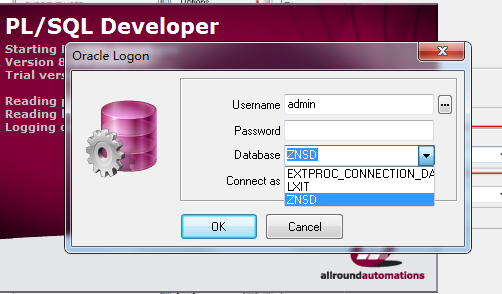

# Oracle-初识

##### 简介		

​	Oracle Database，又名Oracle RDBMS(Relational DataBase Managerment System)，或简称Oracle。是甲骨文公司的一款关系数据库管理系统。它是在数据库领域一直处于领先地位的产品。可以说Oracle数据库系统是目前世界上流行的关系数据库管理系统，系统可移植性好、使用方便、功能强，适用于各类大、中、小、微机环境。它是一种高效率、可靠性好的 适应高吞吐量的数据库解决方案。ORACLE数据库系统是美国ORACLE公司(甲骨文)提供的以分布式数据库为核心的一组软件产品，是目前最流行的客户/服务器(CLIENT/SERVER)或B/S体系结构的数据库之一

​	**Oracle官网：https://www.oracle.com/index.html**

​	**相较于Mysql：**

|                 | Oracle                                                       | Mysql                                                        |
| --------------- | ------------------------------------------------------------ | ------------------------------------------------------------ |
|                 | 大型数据库，支持大并发，大访问量。占用系统空间大（3、4GB），对机器性能要求高。适用于企业级大型项目 | 中小型数据库，开源免费，小巧（安装后不到200MB），适用于小型项目 |
| 主键            | 使用序列记录主键                                             | 一般使用自动增长类型(auto increment)                         |
| 翻页            | ROWNUM(rownum只能写成rownum<100，而不能写rownum > 10)        | LIMIT                                                        |
| varchar字符长度 | 4000，超过4000需要用CLOB类型                                 | 65535                                                        |
| 空字符          | 没有空内容的表示                                             | 非空字段也有空的内容                                         |
| 锁              | 行级锁， 不依赖索引                                          | 默认表级锁，InnoDB可锁行，需使用索引                         |
| 提交方式        | 默认不自动提交                                               | 默认自动提交                                                 |
|                 | ....                                                         | ....                                                         |

​	

##### 安装

* 下载地址：https://www.oracle.com/downloads/index.html#database
* 下载后选中两部分下载包同时解压到一个文件夹中

* 远行setup.exe安装文件

  

* 

* 根据安装提示将Oracle安装完成。

##### 联接Oracle

* 使用Sqlplus联接Oracle

  * 进入DOS命令窗口，运行 sqlplus

  * sqlplus loginName/password@host_ip:port/service_name（databaseName）

    

* 使用PLSQL联接Oracle

  * Oracle安装完成之后(包括客户端client)，配置Oracle的联接信息

  

  * 添加服务

  

  * 设置plsql的connection内容Oracle Home为：OraClient10g_home1

    

  * 关闭plsql后重新打开，选择"Database"，输入数据库的用户名密码登录Oracle

    

  * Oracle系统角色

    * 

  * Oracle默认用户

    | 用户名/密码     | 登录身份          | 说明                                        |
    | --------------- | ----------------- | ------------------------------------------- |
    | sys/system      | SYSDBA 或 SYSOPER | 不能以 NORMAL 登录，可作为默认的系统管理员  |
    | system/manager  | SYSDBA 或 NORMAL  | 不能以 SYSOPER 登录，可作为默认的系统管理员 |
    | sysman/oem_temp | sysman            |                                             |
    | scott/tiger     | NORMAL            |                                             |
    | aqadm /aqadm    | SYSDBA 或 NORMAL  | 高级队列管理员                              |
    | Dbsnmp/dbsnmp   | SYSDBA 或 NORMAL  | 复制管理员                                  |

##### oracle结构

​	Oracle数据库由物理结构与逻辑结构所组成

* 物理结构包含数据库中的一组操作系统文件
  * 数据文件
    * 一个数据库的数据文件包含全部数据库数据
    * 逻辑数据库结构(如表、索引)的数据物理地存储在数据库的数据文件中
    * 一个数据文件仅与一个数据库联系
    * 一旦建立，数据文件不能改变大小
  * 控制文件
    * 记录数据库的物理结构
    * 数据库名、数据库数据文件和日志文件的名字和位置
  * 日志文件
    * 日志文件记录对数据库的所有修改信息，用于故障恢复
  * 操作系统数据块(OS Block，文件系统存放数据的最小分配单元)
* 逻辑结构
  * 数据块
    * 数据库内部I/O最小单位，数据库的最小逻辑单元
  * 区
    * 数据库中若干数据块的集合
  * 段
    - 段是存储的对象，例如一张表或一个索引，都对应一个段。段由若干区组成
    - 表、索引...视图不属于段(不存储数据)
  * 表空间
    - 一个表空间对应一个或多个物理数据文件
    - 表空间包含多个段
    - 系统表空间、临时表空间、撤销表空间、用户表空间
* 对应关系
  * 一个数据库对应一个或多个表空间
  * 一个表空间对应一个或多个数据文件