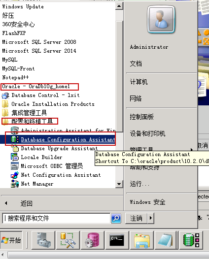
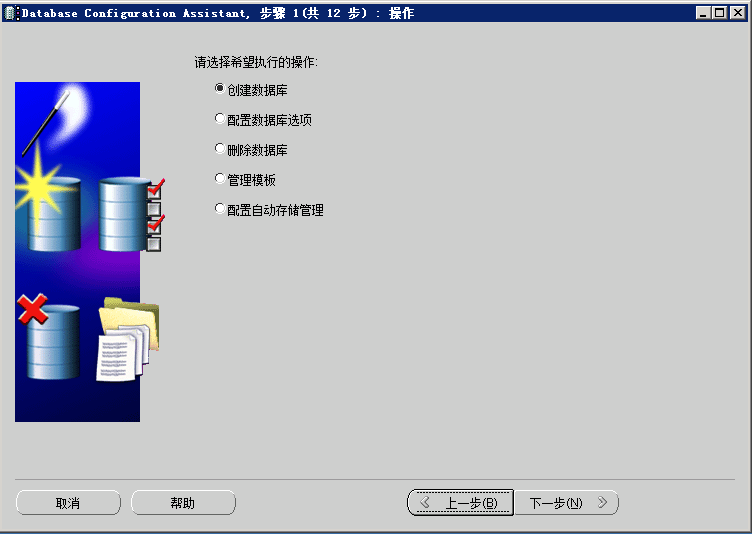
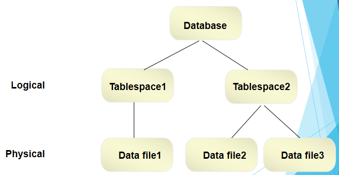

# Oracle操作

##### oracle用户	

* oracle系统用户表：sys.user$，dba_users（视图）

* 创建用户

  ```sql
  	create user "用户名" identified by "密码";
  e.g:
  	create user loyal identified by loyal;
  	--新建一个用户“loyal”，密码为“loyal”
  ```

* 删除用户

  ```sql
  	drop user loyal [cascade（级联删除用户所有相关的对象）]
  e.g:
  	drop user loyal cascade;
  ```

* 修改用户信息

  ```sql
  --修改密码
  alert user loyal identified by "new password"
  --锁定
  alter user loyal account lock;
  --解锁
  alter user loyal account unlock;
  ```

* 用户授权

  * DBA: 拥有全部特权，是系统最高权限，只有DBA才可以创建数据库结构。
  * RESOURCE:拥有Resource权限的用户只可以创建实体，不可以创建数据库结构。
  * CONNECT:拥有Connect权限的用户只可以登录Oracle，不可以创建实体，不可以创建数据库结构

  ```sql
  	grant "权限" to "用户名";
  --常用权限：create table（建表）、create view（建视图）、create public synonym（建同义词）、create procedure（建过程、函数、包）、create trigger（建触发器）、insert/delete/update/select
  e.g:
  	grant connect，resource to loyal;-- 授予loyal用户操作及登录oracle的权限
  	grant select on t_user to loyal;-- 授予loyal用户查询t_user表的权限
  	grant all privileges to loyal;--授予loyal用户所有权限
  ```

  * 撤消权限

  ```sql
  	revoke "权限" from "用户名";
  e.g:
  	revoke connect from loyal;--撤消loyal用户登录oracle的权限
  ```

##### 数据库操作

* 创建数据库：需安装Oracle服务，通过“Databae Configuration Assistant”配置生成新的数据库

  

  


根据操作提示一步步完成数据库创建

* sqlplus常用命令

  ```shell
  # 不登录到数据库服务器
  sqlplus /nolog
  # 不需要listener进程
  sqlplus / as sysdba
  # 登录数据库
  connect username/password
  # 显示当前登录用户
  show user
  # 查看当前用户的角色
  select * from user_role_privs;
  # 查找用户下的所有表
  select * from tab;
  # 查看系统拥有哪些用户
  select * from all_users; 
  ```

##### 表空间

​	数据库的逻辑存储空间，可以理解为在数据库中开辟的空间用来存储数据库对象

* 永久表空间
  * 存储数据库中需要永久化存储的对象，比如二维表、视图、存储过程、索引
* 临时表空间
  * 数据库操作当中中间执行的过程，执行结束后，存放的内容会被自动释放
* UNDO表空间
  * 保存数据修改前的副本，以便回滚、恢复数据。



* 创建表空间

  ```sql
      CREATE TABLESPACE 表空间名
      DATAFILE '数据文件路径' 
      SIZE (表空间大小，单位为K或者M)
      [AUTOEXTEND ON](是否自动扩展) ; 
  e.g:
  	 create tablespace loyal_space 
  	 datafile 'C:\oracle\loyal_space.dbf' 
  	 size 1000M 
  	 autoextend off;	 
  ```

* 查看表空间

  ```sql
  dba_tablespaces --表空间所存的表
  dba_data_files  --数据文件存放的表
  DBA_TEMP_FILES	--临时文件信息 	
  ```

* 修改表空间

  ```sql
  -- 修改表空间状态，联机、脱机(脱机状态下表空间不可用)
  alter tablespace tablespace_name online|offline;
  -- 设置只读或可读写的状态(只有在联机状态才可以更改,默认的联机状态就是读写状态)
  alter tablespace tablespace_name read only | read write;
  -- 增加数据文件
  alter tablespace tablespace_name add datafile ‘xx.dbf’ size xx;
  ```

* 删除表空间

  ```sql
  -- 从数据字典中删除表空间
  -- including contents 数据文件一起删除
  drop tablespace tablespace_name[including contents];
  ```

* 创建用户指定表空间

  ```sql
  	create user 用户名 identified by 密码 default tablespace 表空间表
  e.g:
  	create user test_17h1 identified by test_17h1 default tablespace loyal_space;
  	-- 为用户添加表空间
  	alter user loyal default tablespace loyal_space;
  ```

##### 表（table）

* 创建表

  ```sql
      CREATE TABLE [schema.]table_name
      (
          column_name datatype [DEFAULT expr][,…]
      );
  e.g:
      create table t_user(
             id integer primary key,
             name varchar2(100) not null,
             sex varchar2(1) not null
      );
  -- 根据查询结果创建表
  CREATE TABLE table_name
          [(column1,column2…)]
  AS subquery;
  e.g:
  create table t_user as select * from table_name;
  ```

* 修改表

  ```sql
  --添加一个字段
  alter table t_user add (age number(2));
  --修改一个字段的长度
  alter table t_user modify (name varchar2(50));
  --删除一个字段
  alter table t_user drop column age;
  --修改表的名字
  rename t_user to t_u;
  ```

* 删除表

  ```sql
  drop table table_name
  ```

##### 索引

​	索引与表一样，也属于段（segment）的一种。里面存放了用户的数据，跟表一样需要占用磁盘空间。索引是一种允许直接访问数据表中某一数据行的树型结构，为了提高查询效率而引入，是一个独立于表的对象，可以存放在与表不同的表空间中。索引记录中存有索引关键字和指向表中数据的指针（地址）。对索引进行的I/O操作比对表进行操作要少很多。索引一旦被建立就将被Oracle系统自动维护，查询语句中不用指定使用哪个索引

* 索引是数据库对象之一，用于加快数据的检索，类似于书籍的索引
* 索引是建立在表上的可选对象；索引的关键在于通过一组排序后的索引键来取代默认的全表扫描检索方式，从而提高检索效率
* 索引在逻辑上和物理上都与相关的表和数据无关，当创建或者删除一个索引时，不会影响基本的表
* 索引一旦建立，在表上进行DML操作时，oracle会自动管理索引，索引删除，不会对表产生影响
* 索引对用户是透明的，无论表上是否有索引，sql语句的用法不变
* oracle创建主键时会自动在该列上创建索引

```sql
--unique表示唯一索引,bitmap，创建位图索引
CREATE [UNIQUE] | [BITMAP] INDEX index_name  
ON table_name([column1 [ASC|DESC],column2    
[ASC|DESC],…] | [express])
[TABLESPACE tablespace_name]
--指定索引在数据块中空闲空间
[PCTFREE n1]                                 
[STORAGE (INITIAL n2)]
--表示创建和重建索引时允许对表做DML操作，默认情况下不应该使用
[NOLOGGING]                                  
[NOLINE]
--表示创建索引时不进行排序，默认不适用，如果数据已经是按照该索引顺序排列的可以使用
[NOSORT];                                    

e.g:
create index user_name_index on t_user(name)
--复合索引
create index user_name_index on t_user(name,sex)

--修改索引
alter index user_name_index rename to uname_index;
--合并索引
alter index user_name_index coalesce;
--重建索引
alter index user_name_index rebuild;
--删除索引
drop index user_name_index;
--查看索引
select * from all_indexes;
--分析
alter index index_name validate structure;
--查询碎片，如果pct_used的值过低，说明存在碎片，可重建索引
select name,pct_used from index_stats where name='index_name';  
```

* B树索引（默认索引，保存排序过的索引列和对应的rowid值）

  * oracle中最常用的索引；B树索引就是一颗二叉树；叶子节点（双向链表）包含索引列和指向表中每个匹配行的ROWID值
  * 所有叶子节点具有相同的深度，因而不管查询条件怎样，查询速度基本相同
  * 能够适应精确查询、模糊查询和比较查询
  * 列基数（列不重复值的个数）大时适合使用B数索引

* 位图索引

  * 创建位图索引时，oracle会扫描整张表，并为索引列的每个取值建立一个位图（位图中，对表中每一行 使用一位（bit，0或者1）来标识该行是否包含该位图的索引列的取值，如果为1，表示对应的rowid所在的记录包含该位图索引列值），最后通过位图索 引中的映射函数完成位到行的ROWID的转换
  * 对于基数小的列适合简历位图索引

* 反向键索引

  * 反向键索引反转索引列键值的每个字节，为了实现索引的均匀分配，避免b树不平衡通常建立在值是连续增长的列上，使数据均匀地分布在整个索引上 创建索引时使用REVERSE关键字,适用于某列值前面相同，后几位不同的情况

    ```sql
    create index index_name on table_name (column_name) reverse;
    某一列的值：    1001 1002 1003 1004 1005 1006 1007 
    索引转化：	   1001 2001 3001 4001 5001 6001 7001
    ```

* 函数索引

  * 当经常要访问一些函数或者表达式时，可以将其存储在索引中，这样下次访问时，该值已经计算出来了，可以加快查询速度

    ```
    create index upp_name_index  on t_user (upper(name));
    ```

* 建索引的原则

  * 如果有两个或者以上的索引，其中有一个唯一性索引，而其他是非唯一，这种情况下oracle将使用唯一性索引而完全忽略非唯一性索引
  * 至少要包含组合索引的第一列（即如果索引建立在多个列上，只有它的第一个列被where子句引用时，优化器才会使用该索引）
  * 小表不要简历索引
  * 对于基数大的列适合建立B树索引，对于基数小的列适合简历位图索引
  * 列中有很多空值，但经常查询该列上非空记录时应该建立索引
  * 经常进行连接查询的列应该创建索引
  * 使用create index时要将最常查询的列放在最前面
  * LONG（可变长字符串数据，最长2G）和LONG RAW（可变长二进制数据，最长2G）列不能创建索引
  * 限制表中索引的数量

* 不会使用索引的查询

  * 使用通配符，如：where name like "%abc%"
  * 不要在索引列上使用not、<>,使用其它方式代替，如：age <> 100，改成 age > 100 and age < 100
  * 索引上使用空值比较将停止使用索引,如：name is null
  * 索引列上不要使用函数，如：where upper(name)  = “aa”

##### 约束

​	约束是在表上强制执行的数据校验规则，主要用于保证数据库的完整性

* 主键约束（PRIMARY KEY）

  * 主键是定位表中单个行的方式，可唯一确定表中的某一行，关系型数据库要求所有表都应该有主键，不过Oracle没有遵循此范例要求，Oracle中的表可以没有主键

  * 键列必须必须具有唯一性，且不能为空，其实主键约束 相当于 UNIQUE+NOT NULL

    ```sql
    alter table table_name add constraint pk_name primary key(column_name);
    ```

* 唯一性约束（UNIQUE)

  * 唯一性约束可作用在单列或多列上，对于这些列或列组合，唯一性约束保证每一行的唯一性

  * UNIQUE允许null值，UNIQUE约束的列可存在多个null。这是因为，Unique唯一性通过btree索引来实现，而btree索引中不包含null。当然，这也造成了在where语句中用null值进行过滤会造成全表扫描

    ```sql
    alter table table_name add constraint uni_name unique(column_name);
    ```

* 非空约束（NOT NULL)

  * 非空约束作用的列也叫强制列

    ```sql
    alter table table_name modify column_name not null;
    ```

* 外键约束（FOREIGN KEY）

  * 外键约束定义在具有父子关系的子表中，外键约束使得子表中的列对应父表的主键列，用以维护数据库的完整性

    ```sql
    --  on delete cascade 可级联删除
    alter table table_name add constraint fk_name foreign key(column_name) references table_name (cloum_name) on delete cascade;
    --  将对应子表中的所有匹配行的外键约束列置为NULL
    alter table table_name add constraint fk_name foreign key(column_name) references table_name (cloum_name) on delete set null;
    ```

* 检查约束（CHECK)

  * 检查约束可用来实施一些简单的规则，比如列值必须在某个范围内

    ```sql
    alter table table_name add constraint ck_name check(sex in('男','女'));
    ```

* 约束创建

  ```sql
  -- 创建表时添加约束
  create table T_USER
  (
    ID   INTEGER not null,
    NAME VARCHAR2(100) not null,
    SEX  VARCHAR2(1) not null,
    clsid NUMBER,
    CONSTRAINT pk_uid PRIMARY KEY(ID),
    CONSTRAINT uq_uName UNIQUE(NAME),
    CONSTRAINT fk_clsid FOREIGN KEY (clsid) REFERENCES tb_class(clsid)
  );
  --建表之后添加约束
  alter table table_name add constraint ck_name check(sex in('男','女'));
  alter table table_name add constraint uni_name unique(column_name);
  --删除约束
  ALTER TABLE table DROP constraint_name;
  --查看约束
  select * from USER_CONSTRAINTS;
  select * from USER_CONS_COLUMNS;
  ```
