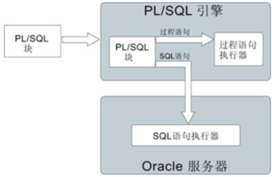

# Oracle-PLSQL

​	PL/SQL是 Procedure Language & Structured Query Language 的缩写,PL/SQL是对SQL语言存储过程语言的扩展，它是一种过程处理语言。PL/SQL包括两部分：一部分是数据库引擎部分，另一部分是可嵌入到许多产品（如C语言，JAVA语言等）工具中的独立引擎。两者的编程非常相似。都具有编程结构、语法和逻辑机制

* 过程化

  * PL/SQL是Oracle在标准SQL上的过程性扩展，不仅允许在PL/SQL程序内嵌入SQL语句，而且允许使用各种类型的条件分支语句和循环语句，可以多个应用程序之间共享其解决方案

* 模块化

  * PL/SQL程序结构是一种描述性很强、界限分明的块结构、嵌套块结构，被分成单独的过程、函数、触发器，且可以把它们组合为程序包，提高程序的模块化能力

* 运行错误的可处理性

  * 使用PL/SQL提供的异常处理（EXCEPTION），开发人员可集中处理各种ORACLE错误和PL/SQL错误，或处理系统错误与自定义错误，以增强应用程序的健壮性

    


##### PL/SQL语句块

​	**PL/SQL**程序由三个块组成，即声明部分、执行部分、异常处理部分

* 无名块或匿名块（anonymous）
  * 动态构造，只能执行一次，可调用其它程序，但不能被其它程序调用
* 命名块（named）
  * 是带有名称的匿名块，这个名称就是标签
* 子程序（subprogram）
  * 存储在数据库中的存储过程、函数等。当在数据库上建立好后可以在其它程序中调用它们
* 触发器（Trigger）
  * 当数据库发生操作时，会触发一些事件，从而自动执行相应的程序
* 程序包/包（package）
  * 存储在数据库中的一组子程序、变量定义。在包中的子程序可以被其它程序包或子程序调用。但如果声明的是局部子程序，则只能在定义该局部子程序的块中调用该局部子程

##### PL/SQL结构

```sql
DECLARE           --声明部分
   声明语句
BEGIN             --执行部分
   执行语句
EXCEPTION         --异常处理部分
   执行语句
END;
```

* 声明语句

  * 变量声明

  ```sql
  --普通变量
  v_变量名 数据类型 := 值;-- := 表示赋值
  --特殊类型======字段%type
  v_name t_user.name%type --表示name的类型和t_user.ename的类型相同
  --赋值
  select t.name into v_name from t_user t where rownum = 1
  
  --表类型===========%rowtype
  v_user t_user%rowtype --表示v_user的类型为t_user表的行类型;也有 .name; .sex; .age ;等属性
  --赋值
  select t.* into v_user from t_user t where rownum = 1
  --常量声明
  <变量名> CONSTANT 类型:=初始值; 
  C_query_size constant number(3):=100;
  ```

  * TYPE定义

  ```sql
  declare
    TYPE type_user IS RECORD(
         user_id t_user.id%type,
         user_name t_user.name%type,
         dept_name t_dept.name%type
    );-- 自定义一个type:type_user
    v_user type_user;--定义一个type_user类型的变量
  begin
      -- 为v_user变量赋值
      select u.id,u.name,d.name into v_user from t_user u,t_dept d where u.dept_id = d.id;
      dbms_output.put_line(v_user.user_id);
      dbms_output.put_line(v_user.user_name);
      dbms_output.put_line(v_user.dept_name);
  end;
  ```

  * 全局变量声明

  ```sql
  VARIABLE <变量名> 类型; 
  e.g:
  	VARIABLE num number;
  --使用全局变量
  :<变量名>
  e.g:
  	:num:=100;
  ```

  * 用户交互输入

  ```SQL
  v_name := '&name';
  e.g:
  declare
   v_name varchar2(100);
  begin
    v_name := '&name';
    dbms_output.put_line(v_name);
  end;
  ```

  * 条件控制语句

  ```sql
  IF <条件1> THEN 
  	语句 
  [
      ELSIF <条件n> THEN 注意是ELSIF 
  	语句
  ] 
  [
      ELSE 
  	语句
  ] 
  END IF;
  ```

  * 流程控制

  ```sql
  CASE variable
      WHEN value1 THEN statements1;
      WHEN value2 THEN statements2;
      ……
      WHEN valuen THEN statementsn;
      [ELSE else_statements;]
  END CASE;
  ```

  * 循环控制语句

  ```sql
  LOOP 
  	语句; 
  	EXIT WHEN <条件> 
  END LOOP;
  --
  WHILE <条件> 
  LOOP 
  	语句; 
  END LOOP;
  --
  FOR <循环变量> IN 下限..上限 
  LOOP 
  	语句; 
  END LOOP;
  ```

  * 异常处理

  ```sql
  EXCEPTION 
  WHEN <异常类型> THEN 
  	语句; 
  WHEN OTHERS THEN  
  	语句; 
  END;
  
  e.g:
  
  declare
    E_self exception; -- 定义异常
  begin
    EXECUTE IMMEDIATE 'select 123 from dual where :1 = :2' using 2,2;
      RAISE E_self;	-- 抛出异常
    exception  when E_self then -- 捕获异常
      dbms_output.put_line(SQLCODE||':'||SQLERRM);--SQLCODE：异常码，SQLERRM：信息
  end;
  ```


| timeout_on_resource | Oracle在等待资源时发生超时的现象                             |
| ------------------- | ------------------------------------------------------------ |
| access_into_null    | 视图给一个没有初始化的对象赋值                               |
| case_not_found      | 在CASE语句中没有WHEN子句被选择，并且没有ELSE子句             |
| invalid_number      | 视图将一个非有效的字符串转换成数字                           |
| loggin_denied       | 使用无效的用户名和口令登录Oracle                             |
| no_data_found       | 查询语句无返回数据，或者引用了一个被删除的元素，或者引用了一个没有被初始化的元素 |


##### 动态SQL

```sql
--dynamic_sql：表示一个SQL语句或者一个PL/SQL语句块的字符串表达式
EXCEUTE IMMEDIATE dynamic_sql;
e.g:
	declare
    begin
    	EXECUTE IMMEDIATE 'select 123 from dual where :1 = :2' using 2,2;
    end;
 -- ：1，：2 占位符，使用using关键字传参
```

##### 事务

* 原子性（Atomicity）

  * 事务是一个完整的操作，事务的各步操作是不可分的（原子的）；要么都执行，要么都不执行

* 一致性（Consistency）

  * 当事务完成时，数据必须处于一致状态

* 隔离性（Isolation）

  * 并发事务之间彼此隔离、独立，它不应以任何方式依赖于或影响其他事务

    | 隔离级别                    | 脏读 | 非重复读 | 幻读 |
    | --------------------------- | ---- | -------- | ---- |
    | Read uncommitted(非提交读)  | 是   | 是       | 是   |
    | Read committed（提交读）    | 否   | 是       | 是   |
    | Repeatable read（可重复读） | 否   | 否       | 是   |
    | Serializable（串行读）      | 否   | 否       | 否   |

  ```sql
  -- 设置事务的隔离级别
  SET TRANSACTION ISOLATION LEVEL 
  [READ UNCOMMITTED|READ COMMITTED
  |REPEATABLE READ|SERIALIZABLE]
  例：
    Set transaction read only
    Set transaction read write
    Set transaction isolation level read committed
    Set transaction isolation level serializable
  ```

* 持久性（Durability）

  * 事务完成后，它对数据库的修改被永久保持

开启Oracle事务：

```sql
-- 开启事务
SAVEPOINT a;      --设置事务存储点
--提交事务
COMMIT         
--回滚部分事务
ROLLBACK to a  
--回滚所有事务
ROLLBACK  

e.g:
declare
  E_self exception;
begin
    savepoint a;
    EXECUTE IMMEDIATE 'select 123 from dual where :1 = :2' using 2,2;
    RAISE E_self;
    commit;
  exception 
    when E_self then
      dbms_output.put_line(SQLCODE || ':' || SQLERRM);
      rollback to a;
end;
```

##### 锁

​	在多用户数据库中，多个并发事务中的语句可以更新相同的数据。同时执行的事务需要产生有意义且一致的结果。因此，在多用户数据库中控制数据并发性和数据一致性至关重要。

​	多用户数据库使用某种形式的数据锁定来解决与数据并发性，一致性和完整性相关的问题。锁是防止访问相同资源的事务之间的破坏性交互的机制

**数据库锁的分类**

* 排它锁（Exclusive Locks，即X锁）

  * 当数据对象被加上排它锁时，其他的事务不能对它修改

  ```sql
  --添加该X锁
  lock table table_name in exclusive mode
  ```

* 共享锁（Share Locks，即S锁）

  * 数据对象可以被其他事务读取，但不能修改

  ```sql
  --添加该S锁
  lock table table_name in share mode
  ```

* 行级共享锁（RS锁）

  * 通过select … from for update语句添加

* 行级排他锁（RX锁）

  * DML操作时会自动在被更新的表上添加RX锁

  ```sql
  LOCK table table_name IN 
      [row exclusive] MODE 
  [NOWAIT];
  ```

* 共享行级排他锁（SRX锁）

  * 该锁定模式比行级排他锁和共享锁的级别都要高，这时不能对相同的表进行DML操作，也不能添加共享锁

  ```sql
  --命令添加SRX锁
  lock table table_name in share row exclusive mode
  ```

**Oracle数据库锁细分为**

* DML lock（data locks，数据锁）：用于保护数据的完整性
  * 包括TM锁和TX锁，其中TM锁称为表级锁，TX锁称为事务锁或行级锁
* DDL lock（dictionary locks，字典锁）：用于保护数据库对象的结构（例如表、视图、索引的结构定义）
* Internal locks 和latches（内部锁与闩）：保护内部数据库结构
* Distributed locks（分布式锁）：用于OPS（并行服务器）中
* PCM locks（并行高速缓存管理锁）：用于OPS（并行服务器）中

**查看死锁与解锁**

* 查看死锁

  ```sql
  SELECT *
    FROM v$session
   WHERE sid IN (SELECT sid FROM v$lock WHERE block = 1)
  ```

* 查看倒致死锁的sql

  ```sql
  SELECT s.sid, q.sql_text
  FROM v$sqltext q, v$session s
  WHERE q.address = s.sql_address AND s.sid in (SELECT sid FROM v$lock) 
  ORDER BY piece;
  ```

* kill session

  ```sql
  -- 执行拼的sql，杀死session
  SELECT 'alter system kill session ''' || sid || ',' || serial# || ''';' "Deadlock"
    FROM v$session
   WHERE sid IN (SELECT sid FROM v$lock WHERE block = 1);
  ```


