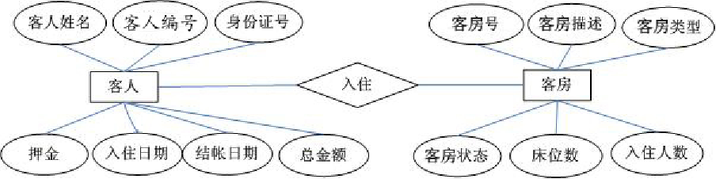
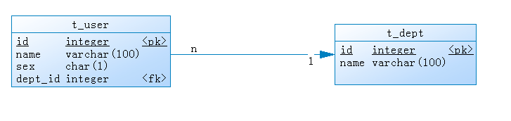

# Oracle-数据对象

​	Oracle的数据对象包括：table 表、view 视图、sequence 序列、index 索引、synonym 同义词

##### View视图

​	视图是一种虚表。视图建立在已有表的基础上, 视图赖以建立的这些表称为基表。向视图提供数据内容的语句为 SELECT 语句, 可以将视图理解为存储起来的 SELECT 语句。视图向用户提供基表数据的另一种表现形式

特点：

* 经过查询操作形成的结果
* 具有普通表的结构
* 不能实现数据的存储
* 对视图的修改将会影响实际的数据表

创建视图：

```sql
CREATE [OR REPLACE] [FORCE|NOFORCE] VIEW view
  [(alias[, alias]...)]
 AS subquery
[WITH CHECK OPTION [CONSTRAINT constraint]]
[WITH READ ONLY [CONSTRAINT constraint]];
--FORCE： 子查询不一定存在
--NOFORCE： 子查询存在（默认）
--CHECK OPTION：必须要满足的视图的约束
--WITH READ ONLY:只能做查询操作
e.g:
	create or replace force view loyal_view as select t.name,t.sex from t_user t;
--查询视图：
select * from loyal_view;
```

删除视图：

```sql
DROP VIEW view_name
```

视图的好处：

* 限制数据访问
* 简化复杂查询
* 提供数据的相互独立
* 同样的数据，可以有不同的显示方式

##### sequence 序列

​	序列(SEQUENCE)是序列号生成器，可以为表中的行自动生成序列号，产生一组等间隔的数值(类型为数字)。不占用磁盘空间，占用内存。是数据库的内置对象，主要用于提供主键值

* 创建序列

```sql
CREATE SEQUENCE sequence
       [INCREMENT BY n]				--序列的步长
       [START WITH n]				--开始值
       [{MAXVALUE n | NOMAXVALUE}]	--最大值，NOMAXVALUE默认选项，无最大值，10的27次方
       [{MINVALUE n | NOMINVALUE}]
       [{CYCLE | NOCYCLE}]			--序列达到限制值时，是否循环，CYCLE代表循环，
       [{CACHE n | NOCACHE}];		--对序列进行内存缓存存放，n表示内存缓存空间大小
e.g:
create sequence loyal_seq increment by 1 start with 1 NOCYCLE cache 20;
```

* 使用序列

  ```sql
  sequence_name.NEXTVAL --序列下一个值
  sequence_name.CURRVAL --序列当前值
  e.g:
  select sequence_name.NEXTVAL from dual;
  ```

* 修改序列

  ```sql
  ALTER SEQUENCE seq_name
  [ increment by n ]
  [ maxvalue n | nomaxvalue ]
  [ minvalue n | nominvalue ];
  ```

* 删除序列

  ```sql
  DROP SEQUENCE seq_name
  ```

##### synonym 同义词

​	数据库对象的别名，如表、视图、序列、存储过程、包等。在数据库中使用同义词就相当于使用对应的数据库对象。简化了数据库对象的访问，提高了数据库对象访问的安全性。

* 创建同义词

  ```sql
  create public synonym t_a for  user.table_a;
  --使用t_a时就等于使用user.table_a
  select * from t_a;
  
  --查询所有同义词
  select * from dba_synonyms;
  ```

* 删除同义词

  ```sql
  drop synonym t_a;
  ```

##### 数据库设计

* 软件项目开发周期中数据库设计
  * 需求分析阶段：分析客户的业务和数据处理需求
  * 概要设计阶段：设计数据库的E-R模型图，确认需求信息的正确和完整
  * 详细设计阶段：应用三大范式审核数据库结构
  * 代码编写阶段：物理实现数据库，编码实现应用
  * 软件测试阶段：……
  * 安装部署：发布应用


* 设计数据库的步骤

  * 收集信息

    * 与该系统有关人员进行交流、座谈，充分了解用户需求，理解数据库需要完成的任务

  * 标识实体 （Entity）

    * 标识数据库要管理的关键对象或实体，实体一般是名词

  * 标识每个实体的属性（Attribute）

  * 标识实体之间的关系（Relationship）

  * 绘制E-R图

    * 酒店管理系统的数据库

    

  * 绘制数据库模型图

    

* 数据库设计三范式

  * 数据库表中的字段都是单一属性的，不可再分
    * 确保每一列的原子性，做到不可再分
  * 数据库表中不存在非关键字段对任一候选关键字段的部分函数依赖，即符合第二范式
    * 一张表中只可保存一种数据，确保表中的每列都和主键相关，每条数据都是唯一的
  * 在第二范式的基础上，数据表中如果不存在非关键字段对任一候选关键字段的传递函数依赖则符合3NF
    * 确保每列都和主键列直接相关,而不是间接相关，表与表之间的关联关系必须建立在主键上。