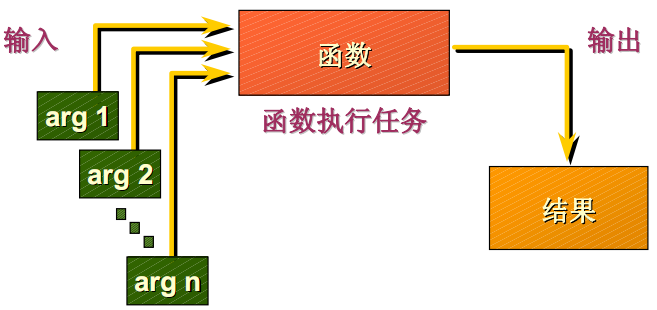

# Oracle-function

​	[Oracle](http://lib.csdn.net/base/oracle) SQL 提供了用于执行特定操作的专用函数。这些函数大大增强了 SQL 语言的功能。函数可以接受零个或者多个输入参数，并返回一个输出结果



* 单行函数：对每一个函数应用在表的记录中时，只能输入一行结果，返回一个结果
* 聚合函数(多行函数)：聚合函数同时可以对多行数据进行操作，并返回一个结果


##### 单行函数

* 字符函数

  * 字符函数接受字符参数，这些参数可以是表中的列，也可以是一个字符串表达式
    * ASCII(X)：返回字符X的ASCII码
    * CONCAT(X,Y)：连接字符串X和Y
    * INSTR(X,STR[,START][,N)：从X中查找str，可以指定从start开始，也可以指定从n开始
    * LENGTH(X)：返回X的长度
    * LOWER(X)：X转换成小写
    * UPPER(X)：X转换成大写
    * SUBSTR(X,start[,length])：返回X的字串，从start开始，截取length个字符，缺省length默认到结尾
    * REPLACE(X,old,new)：在X中查找old，并替换成new
    * TRIM([TRIM_STR  FROM]X)：把X的两边截去trim_str字符串，缺省截去空格

* 数字函数

  * 数字函数接受数字参数，参数可以来自表中的一列，也可以是一个数字表达式
    * ABS(X)：X的绝对值
    * ACOS(X)：X的反余弦
    * COS(X)：余弦
    * CEIL(X)：大于或等于X的最小值
    * FLOOR(X)：小于或等于X的最大值
    * LOG(X,Y)：X为底Y的对数
    * MOD(X,Y)：X除以Y的余数
    * POWER(X,Y)：X的Y次幂
    * ROUND(X[,Y])：X在第Y位四舍五入
    * TRUNC(X[,Y])：X在第Y位截断

* 转换函数

  * 转换函数将值从一种数据类型转换为另外一种数据类型

    * TO_CHAR(d|n[,fmt])：把日期和数字转换为制定格式的字符串。Fmt是格式化字符串

      ```sql
      SELECT TO_CHAR(SYSDATE,'YYYY"年"MM"月"DD"日" HH24:MI:SS')"date" FROM dual;
      ```

    * TO_DATE(X,[,fmt])：把一个字符串以fmt格式转换成一个日期类型

    * TO_NUMBER(X,[,fmt])

* 日期函数

  * 日期函数对日期进行运算。常用的日期函数有

    * ADD_MONTHS(d,n)：在某一个日期 d 上，加上指定的月数 n，返回计算后的新日期

    * LAST_DAY(d)：返回指定日期当月的最后一天

    * EXTRACT(fmt FROM d)：提取日期中的特定部分，fmt 为：YEAR、MONTH、DAY、HOUR、MINUTE、SECOND

    * ROUND(d[,fmt])：返回一个以 fmt 为格式的四舍五入日期值， d 是日期， fmt 是格式

      模型。默认 fmt 为 DDD，即月中的某一天，fmt可以为：YEAR、MONTH、DAY

* 其它函数

  * NVL(X,VALUE)：如果X为空，返回value，否则返回X

  * NVL2(x,value1,value2)：如果x非空，返回value1，否则返回value2

  * DECODE

    ```sql
    --把base_expr与后面的每个compare 进行比较,如果匹配返回相应的value.如果没有发生匹配,则返回default
    DECODE(base_expr,comparel,valuel,
    Compare2,value2,
    …
    default)
    ```

  * GREATEST

    ```sql
    -- 回一组表达式中的最大值,即比较字符的编码大小.
    GREATEST(expr1[,expr2]…)
    e.g:
    select greatest(’AA’,’AB’,’AC’) from dual;
    ```

  * LEAST

    ```sql
    --获得参数中最小的表达式
    LEAST(expr1[,:expr2]…)
    e.g:
    select LEAST(’AA’,’AB’,’AC’) from dual;
    ```

  * CASE

    ```sql
    CASE expr 
       WHEN comparison_expr1 THEN return_expr1
       [WHEN comparison_expr2 THEN return_expr2
       WHEN comparison_exprn THEN return_exprn
       ELSE else_expr]
    END
    ```


##### 聚合函数

​	聚合函数同时对一组数据进行操作返回一行结果，比如计算一组数据的总和，平均值

* AVG：平均值
* SUM：求合
* MIN、MAX：最小，最大
* COUNT：统计

