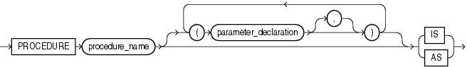

# Oracle-存储过程

##### 游标(CURSOR)

​	游标是SQL的一个内存工作区，由系统或用户以变量的形式定义。游标的作用就是用于临时存储从数据库中提取的数据块。在某些情况下，需要把数据从存放在磁盘的表中调到计算机内存中进行处理，最后将处理结果显示出来或最终写回数据库。这样数据处理的速度才会提高，否则频繁的磁盘数据交换会降低效率

* 隐式游标

  * DML操作会使用隐式游标
  * SELECT ... INTO ...会使用隐式游标
  * 隐式游标的属性
    * SQL%ROWCOUNT：代表DML语句成功执行的数据行数
    * SQL%FOUND：值为TRUE代表插入、删除、更新或单行查询操作成功
    * SQL%NOTFOUND：与SQL%FOUND属性返回值相反
    * SQL%ISOPEN：DML执行过程中为真，结束后为假

  ```sql
  declare
  begin
      update t_user set name='ccc' where id = 2;
      IF SQL%FOUND THEN
         dbms_output.put_line('success');
         commit;
      else
        dbms_output.put_line('error');
      end if;
  end;
  ```

* 显式游标

  * 定义游标

  ```sql
  CURSOR 游标名[(参数1 数据类型[，参数2 数据类型...])] IS SELECT语句; 
  e.g:
  declare
    Cursor cursor_user is select * from t_user;--声名游标
    v_user t_user%rowtype;
  begin
      open cursor_user;--打开游标
      loop
        fetch cursor_user into v_user;--读取游标
        exit when cursor_user%NOTFOUND;
              dbms_output.put_line(v_user.name);
      end loop;
      CLOSE cursor_user;--关闭游标
  end;
  -- 使用for循环：for循环会自动打开关闭游标
  declare
    Cursor cursor_user is select * from t_user;
    v_user t_user%rowtype;
  begin
      for user_record in cursor_user loop
        dbms_output.put_line(user_record.name);
      end loop;
  end;
  ```

  * 游标传参

  ```sql
  CURSOR 游标名[(参数1 数据类型[，参数2 数据类型...])] IS SELECT语句; 
  e.g:
  declare
    Cursor cursor_user(p_name varchar2,p_sex t_user.sex%type) 
    is select * from t_user where name=p_name and sex = p_sex;
    v_user t_user%rowtype;
  begin
      open cursor_user('ccc','M');--打开游标
      loop
        fetch cursor_user into v_user;--读取游标
        exit when cursor_user%NOTFOUND;
              dbms_output.put_line(v_user.name);
      end loop;
      CLOSE cursor_user;--关闭游标
  end;
  ```

* 动态游标

  * 在执行时，动态指定要制定的SELECT语句，动态游标又分为强类型ref游标和弱类型ref游标两种
  * 强类型ref游标
    * TYPE <游标名> IS REF CURSOR RETURN<返回类型>;
    * 只能关联一张表
  * 弱类型ref游标
    * TYPE <游标名> IS REF CURSOR;
    * 可以关联多张表

```sql
declare
  -- 定义强类型的游标TYPE
  TYPE type_user IS REF CURSOR RETURN t_user%ROWTYPE;
  cursor_user type_user;
  v_user t_user%rowtype;
  -- 定义弱类型的游标TYPE
  TYPE type_use IS REF CURSOR;
  cursor_use type_use;
  v_dept t_dept%rowtype;
begin
  -- 打开一个强类型的游标，只能是t_user类型的数据
  open cursor_user for select * from t_user;
  -- 打开一个弱类型的游标，数据类型可以是多个表
  open cursor_use for select * from t_dept d;
  loop
    fetch cursor_user into v_user;
    exit when cursor_user%notfound;
     dbms_output.put_line(v_user.name);
  end loop;
  loop
    fetch cursor_use into v_dept;
    exit when cursor_use%notfound;
     dbms_output.put_line(v_dept.name);
  end loop;
end;
```

##### 函数(FUNCTION)

​	PL/SQL定义的DECLARE匿名块，不能传递参数，只能执行一次，没有名称，也不被存储在数据库中，还不能其它应用程序调用。所以就有了比匿名块功能更强大的函数，函数也可以看做是一个匿名块，它是PL/SQL的子程序，它有自己的名字，可以传递参数，并且绝对会返回一个值给调用方。

* 创建函数

  ```sql
  create [or replace] function [schema.]function_name
  (函数参数列表) --参数有IN、OUT、IN OUT三种类型；IN代表需要输入的参数，OUT代表要返回的参数，IN OUT代表即是输入参数也是返回参数。
  return datetype--返回类型
  [is | as ]---任选一个，后面跟pLSQL代码块
  begin
    --执行的SQL
  end;
  e.g:
  create or replace function f_count_user(
         i_name in varchar2,--in 入参
         i_sex out varchar2 --out 出参，in out :即可做入参又可做出参
         )
     return number
     is
        v_count number;
     begin
         if i_name is not null and i_sex is not null then
           select count(1) into v_count from t_user where name = i_name and sex = i_sex;
         end if;
         i_sex:='bbbb';
         return v_count;
  end f_count_user;
  ```

* 查看函数信息

  ```sql
  --用户拥有的触发器、存储过程、函数查询表
  select * from  User_Procedures;
  --查询用户拥有触发器、存储过程、函数的源码
  select * from User_Source;
  ```

##### 存储过程(PROCEDURE)

​	它由一组SQL语句和其他PL / SQL结构，组合在一起，存储在数据库中的，并运行以解决特定问题或执行一组相关的任务的单元。过程和函数允许调用者提供仅可输入，仅输出或输入和输出值的参数。过程和函数使您可以将SQL的简易性和灵活性与结构化编程语言的过程功能相结合。过程和函数是相同的，除了函数始终向调用者返回单个值，而过程不返回



* 创建过程

```sql
create or replace procedure 过程名[（参数：参数名 in/out/in out 类型，....）]
as
--定义变量
begin
  -- sql....
  EXCEPTION  
  	......
end 过程名;
e.g:
	create or replace procedure p_user_proce
    as
           v_label varchar2(100):='success';
    begin
      dbms_output.put_line(v_label);
    end p_user_proce;
    -- 调用存储过程
    call p_user_proce();
    -- 在程序块里或者函数、过程中调用，直接引用过程名便可
    p_user_proce（）;
```

##### 包（PACKAGE）

​	包是一组相关过程、函数、变量、常量和游标等PL/SQL程序设计元素的组合。它具有面向对象程序设计语言的特点，是对这些PL/SQL 程序设计元素的封装。包类似于C++和Java语言中的类，其中变量相当于类中的成员变量，过程和函数相当于类方法。把相关的程序单元归纳到包里

​	包是一个模式对象，它对逻辑上相关的PL / SQL类型，变量和子程序进行分组。包装通常有两个部分，包头和包体; 有时包体是不必要的。包头是包的接口。它声明了可以从包外部引用的类型，变量，常量，异常，游标和子程序。

* **包的优点**

* 模块化
  * 通过包，您可以在命名的PL / SQL模块中封装逻辑上相关的类型，项和子程序。每个包都很容易理解，包之间的接口简单，清晰，定义明确。这有助于应用程序开发
* 更轻松的应用设计
  * 在设计应用程序时，您最初需要的只是包头中的接口信息。您可以在没有主体的情况下编写和编译规范。然后，也可以编译引用包的存储子程序。在准备好完成应用程序之前，无需完全定义包体
* 信息隐藏
  * 使用包，您可以指定哪些类型，项目和子程序是公共的（可见的和可访问的）或私有的（隐藏的和不可访问的），包头中未声明的过程、函数，只在本包中可调用，对外是隐藏的。
* 更好的性能
  * 当您第一次调用包的子程序时，整个包将加载到内存中。稍后调用包中的相关子程序不需要磁盘I / O

* **定义包头**

```sql
CREATE OR REPLACE PACKAGE 包名 AS
--定义变量，声明过程、函数、游标
END 包名;
e.g:
CREATE OR REPLACE PACKAGE emp_admin AS
   TYPE EmpRecTyp IS RECORD (emp_id NUMBER, sal NUMBER);
   CURSOR desc_salary RETURN EmpRecTyp;
   invalid_salary EXCEPTION;
   PROCEDURE fire_employee (emp_id NUMBER); 
   FUNCTION nth_highest_salary (n NUMBER) RETURN EmpRecTyp;
END emp_admin;
```

* **定义包体**

```sql
CREATE OR REPLACE PACKAGE BODY 包名 AS
--定义过程、函数、游标具体实现
END 包名;
e.g:
CREATE OR REPLACE PACKAGE emp_admin AS
   PROCEDURE fire_employee (emp_id NUMBER) is
   --定义局部变量
   begin
   --sql....
   end fire_employee;
   FUNCTION nth_highest_salary (n NUMBER) RETURN EmpRecTyp is
   --定义局部变量
   begin
   --sql....
   end nth_highest_salary;
END emp_admin;
```

* **调用包**

```sql
-- 包名.过程名，包名.函数名，包名.常量名
packge_name.proce_name/packge_name.function_name
e.g:
declare
   v_name varchar2(100):='test';
   v_sex varchar2(10);
   v_user t_user%rowtype;
begin
     pack_user.p_user_proce();
     v_user := poack_user.f_count_user(v_name,v_sex);
end;
```

##### 触发器（TRIGGER）

​	触发器在数据库里以独立的对象存储，它与存储过程不同的是，存储过程通过其它程序来启动运行或直接启动运行，而触发器是由一个事件来启动运行,即触发器是当某个事件发生时自动地隐式运行。并且，触发器不能接收参数。所以运行触发器就叫触发或点火（firing）.

​	ORACLE事件指的是对数据库的表进行的INSERT、UPDATE及DELETE操作或对视图进行类似的操作,ORACLE将触发器的功能扩展到了DDL触发，包括数据库的启动与关闭等系统事件。

​	触发器类似于JAVA中的监听器，对某一事件进行监听，发生事件后做出相应动作。

* 触发器的组成：
  * 触发事件：如INSERT, UPDATE, DELETE
  * 触发时间：即事件BEFORE或AFTER
  * 触发器本身：即该TRIGGER 被触发之后的执行SQL
  * 触发频率：说明触发器内定义的动作被执行的次数。即语句级(STATEMENT)触发器和行级(ROW)触发器
    * 语句级(STATEMENT)触发器：是指当触发事件发生时，该触发器只执行一次；
    * 行级(ROW)触发器：当某触发事件发生时，对受到该操作影响的每一行数据，触发器都单独执行一次

* 触发器类型：

  * DML触发器

    * ORACLE可以在DML语句进行触发，可以在DML操作前或操作后进行触发，并且可以对每个行（行级）或语句（级）操作上进行触发

      ```sql
      --DML触发器
      CREATE [OR REPLACE] TIGGER 
      	触发器名 
      	触发时间< before | after > 
      	触发事件< insert | update | delete>
      　　ON 表名/视图名
      　　[FOR EACH ROW]  --加上FOR EACH ROW 即为行级触发器，不加时为语句级触发器
      　　[WHEN CONDITION] -- 执行条件
      BEGIN
      　　pl/sql语句
      END;
      ```

  * 系统触发器

    * 可以在ORACLE数据库系统的事件中进行触发，如执行DDL或ORACLE系统的启动与关闭等系统事件

    * 系统触发器的事件和允许时机：

      | 事件                      | 允许的时机 | 说明                 |
      | ------------------------- | ---------- | -------------------- |
      | 启动（STARTUP）           | 之后       | 实例启动时激活       |
      | 关闭（SHUTDOWN）          | 之前       | 实例正常关闭时激活   |
      | 服务器错误（SERVERERROR） | 之后       | 只要有错误就激活     |
      | 登录（LOGON）             | 之后       | 成功登录后激活       |
      | 注销（LOGOFF）            | 之前       | 开始注销时激活       |
      | 创建（CREATE）            | 之前，之后 | 在创建之前或之后激活 |
      | 删除（DROP）              | 之前，之后 | 在撤消之前或之后激活 |
      | 修改（ALTER）             | 之前，之后 | 在变更之前或之后激活 |

      ```sql
      create or replace trigger [schema.]trigger_name 
      {before | after} 
      --database_event_list表示一个说多个数据库事件，多个事件中间用or分开
      {database_event_list} 
      --database表示数据库级触发器；schema表示用户级触发器
      on {database | [schema.]SCHEMA} 
      -- WHEN CONDITION 执行条件
      [WHEN CONDITION] 
      begin
      	pl/sql....
      end;
      ```

  * instead of触发器

    * 创建在视图上并且只能在行级上触发，用于替代insert，delete等操作（由于oracle中不能直接对有两个以上的表建立的视图进行DML操作，所以给出替代触发器，它是专门为进行视图操作的一种处理方法）

      ```sql
      CREATE [OR REPLACE] TRIGGER trigger_name 
      INSTEAD OF
      {INSERT|DELETE|UPDATE [OF COLUMN...]}
      [OR {INSERT| DELETE| UPDATE [OF COLUMN...]}]
      ON VIEW_NAME
      [REFFERENCING{OLD [AS] OLD | NEW [AS] NEW| PARENT AS PARENT}]   
      -- 可以指定相关名称，当前的默认相关名称为OLD和NEW,应用相关名称时需要加：
      [FOR EACH ROW]                     
      --instead of 触发器只能在行级上触发，因为没有必要指定
      [WHEN CONDITION]
      DECLARE
      BEGIN
      END;
      ```

  * DDL触发器

    * 触发事件时数据库对象的创建和修改

      ```sql
      create or replace trigger [schema.]trigger_name 
      {before | after} 
      --DDL_EVENT_LIST表示一个或多个DDL事件，多个事件中间用or分开
      {DDL_EVENT_LIST} 
      --database表示数据库级触发器；schema表示用户级触发器
      on {database | [schema.]SCHEMA} 
      -- WHEN CONDITION 执行条件
      [WHEN CONDITION] 
      begin
      	pl/sql....
      end;
      ```


* 示例

```sql
--DML触发器
create or replace trigger trg_up_user
	after
	update
　　ON t_loyal
  FOR EACH ROW
BEGIN
    dbms_output.put_line(:old.name);
END trg_up_user;

```

