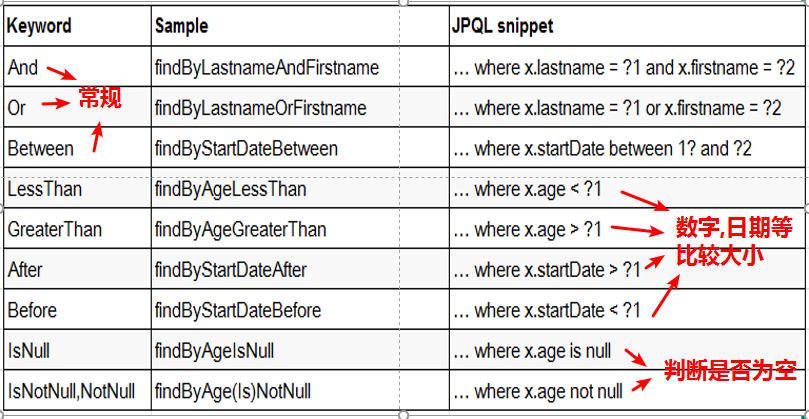
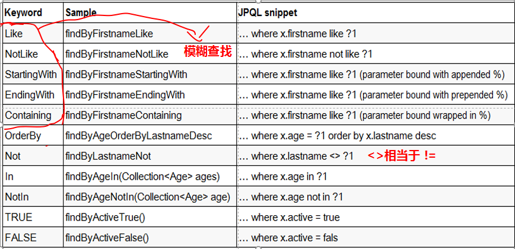

# Spring Data

## 简介

　　SpringData是Spring基于ORM框架、JPA规范封装的一套JPA应用框架。用于简化数据库访问，支持NoSQL 和 关系数据存储。其主要目标是使数据库的访问变得方便快捷。

Spring Data是一个由独立项目组成的总体项目，目前Spring Data包含的主要有以下模块：

- Spring Data Commons
- Spring Data JPA
- Spring Data MongoDB
- Spring Data Redis
- Spring Data REST
- Apache Solr的Spring数据
- Spring Data Elasticsearch（社区模块）
- 等等


## 入门

　　由于Spring Data属于Spring家族一员，对于Spring的整合是非常简易。后面都以Spring+Spring Data环境下演示。

### 环境搭建

步骤：

​	一、 导包（编写pom）

​	二、Spring整合Spring Data

​	三、 持久层编写

​	四、 测试

####  一、导包

① Spring包

② Mysql数据库链接jar包

③ 日志文件管理包 

④ HibernateJap支撑包

⑤ spring data jpq包

⑥ c3p0连接池包

完整pom配置

```xml
<project xmlns="http://maven.apache.org/POM/4.0.0" xmlns:xsi="http://www.w3.org/2001/XMLSchema-instance"
	xsi:schemaLocation="http://maven.apache.org/POM/4.0.0 http://maven.apache.org/xsd/maven-4.0.0.xsd">
	<modelVersion>4.0.0</modelVersion>
	<groupId>com.znsd.springdata</groupId>
	<artifactId>springdata</artifactId>
	<version>0.0.1-SNAPSHOT</version>
	<properties>
		<!-- spring版本号 -->
		<spring.version>4.0.2.RELEASE</spring.version>
		<!-- mybatis版本号 -->
		<mybatis.version>3.2.6</mybatis.version>
		<!-- log4j日志文件管理包版本 -->
		<slf4j.version>1.7.7</slf4j.version>
		<log4j.version>1.2.17</log4j.version>
	</properties>
	<dependencies>
		<!-- spring核心包 -->
		<dependency>
			<groupId>org.springframework</groupId>
			<artifactId>spring-core</artifactId>
			<version>${spring.version}</version>
		</dependency>
		<dependency>
			<groupId>org.springframework</groupId>
			<artifactId>spring-web</artifactId>
			<version>${spring.version}</version>
		</dependency>
		<dependency>
			<groupId>org.springframework</groupId>
			<artifactId>spring-oxm</artifactId>
			<version>${spring.version}</version>
		</dependency>
		<dependency>
			<groupId>org.springframework</groupId>
			<artifactId>spring-tx</artifactId>
			<version>${spring.version}</version>
		</dependency>
		<dependency>
			<groupId>org.springframework</groupId>
			<artifactId>spring-jdbc</artifactId>
			<version>${spring.version}</version>
		</dependency>
		<dependency>
			<groupId>org.springframework</groupId>
			<artifactId>spring-webmvc</artifactId>
			<version>${spring.version}</version>
		</dependency>
		<dependency>
			<groupId>org.springframework</groupId>
			<artifactId>spring-aop</artifactId>
			<version>${spring.version}</version>
		</dependency>
		<dependency>
			<groupId>org.springframework</groupId>
			<artifactId>spring-context-support</artifactId>
			<version>${spring.version}</version>
		</dependency>
		<dependency>
			<groupId>org.springframework</groupId>
			<artifactId>spring-test</artifactId>
			<version>${spring.version}</version>
		</dependency>
		<!-- 导入Mysql数据库链接jar包 -->
		<dependency>
			<groupId>mysql</groupId>
			<artifactId>mysql-connector-java</artifactId>
			<version>5.1.30</version>
		</dependency>
		<!-- 日志文件管理包 -->
		<!-- log start -->
		<dependency>
			<groupId>log4j</groupId>
			<artifactId>log4j</artifactId>
			<version>${log4j.version}</version>
		</dependency>
		<!-- 格式化对象，方便输出日志 -->
		<dependency>
			<groupId>org.slf4j</groupId>
			<artifactId>slf4j-api</artifactId>
			<version>${slf4j.version}</version>
		</dependency>
		<dependency>
			<groupId>org.slf4j</groupId>
			<artifactId>slf4j-log4j12</artifactId>
			<version>${slf4j.version}</version>
		</dependency>
		<!-- log end -->
		<!-- HibernateJap支撑包 -->
		<dependency>
			<groupId>org.hibernate</groupId>
			<artifactId>hibernate-core</artifactId>
			<version>4.3.6.Final</version>
		</dependency>
		<dependency>
			<groupId>org.hibernate</groupId>
			<artifactId>hibernate-entitymanager</artifactId>
			<version>4.3.6.Final</version>
		</dependency>
		<!-- spring data jpq 包-->
		<dependency>
			<groupId>org.springframework.data</groupId>
			<artifactId>spring-data-jpa</artifactId>
			<version>1.7.0.RELEASE</version>
		</dependency>
		<!-- c3p0连接池 -->
		<dependency>
			<groupId>com.mchange</groupId>
			<artifactId>c3p0</artifactId>
			<version>0.9.2.1</version>
		</dependency>
		<dependency>
			<groupId>com.mchange</groupId>
			<artifactId>mchange-commons-java</artifactId>
			<version>0.2.3.4</version>
		</dependency>
	</dependencies>
</project>
```

####  二、Spring整合Spring Data

​	① 开启Spring自动扫描的包

​	② 配置数据源

​	③ 配置jpa实体管理工厂

​	④ 配置事物（a、配置JPA使用的事务管理器；b、开启事物）

​	⑤ 开启持久层扫描

完整配置

```xml
<?xml version="1.0" encoding="UTF-8"?>
<beans xmlns="http://www.springframework.org/schema/beans"
	xmlns:xsi="http://www.w3.org/2001/XMLSchema-instance" xmlns:context="http://www.springframework.org/schema/context"
	xmlns:tx="http://www.springframework.org/schema/tx" xmlns:jpa="http://www.springframework.org/schema/data/jpa"
	xsi:schemaLocation="http://www.springframework.org/schema/beans http://www.springframework.org/schema/beans/spring-beans.xsd
        http://www.springframework.org/schema/data/jpa http://www.springframework.org/schema/data/jpa/spring-jpa-1.3.xsd
        http://www.springframework.org/schema/tx http://www.springframework.org/schema/tx/spring-tx-4.0.xsd
        http://www.springframework.org/schema/context http://www.springframework.org/schema/context/spring-context-4.0.xsd">

	<!-- 配置自动扫描的包 -->
	<context:component-scan base-package="com.znsd.springdata"></context:component-scan>

	<!-- 1. 配置数据源 -->
	<context:property-placeholder location="classpath:db.properties" />

	<bean id="dataSource" class="com.mchange.v2.c3p0.ComboPooledDataSource">
		<property name="user" value="${jdbc.user}"></property>
		<property name="password" value="${jdbc.password}"></property>
		<property name="driverClass" value="${jdbc.driverClass}"></property>
		<property name="jdbcUrl" value="${jdbc.jdbcUrl}"></property>
		<!-- 配置其他属性 -->
	</bean>

	<!-- 2. 配置 JPA 的 EntityManagerFactory -->
	<bean id="entityManagerFactory"
		class="org.springframework.orm.jpa.LocalContainerEntityManagerFactoryBean">
		<!--配置数据源 -->
		<property name="dataSource" ref="dataSource"></property>
		<!-- 配置 JPA 提供商的适配器. 可以通过内部 bean 的方式来配置 -->
		<property name="jpaVendorAdapter">
			<bean class="org.springframework.orm.jpa.vendor.HibernateJpaVendorAdapter"></bean>
		</property>
		<!-- 配置实体类所在的包 -->
		<property name="packagesToScan" value="com.znsd.springdata"></property>
		<!-- 配置 JPA 的基本属性. 例如 JPA 实现产品的属性 -->
		<property name="jpaProperties">
			<props>
				<!-- 二级缓存相关 -->
				<!-- <prop key="hibernate.cache.region.factory_class">org.hibernate.cache.ehcache.EhCacheRegionFactory</prop> 
					<prop key="net.sf.ehcache.configurationResourceName">ehcache-hibernate.xml</prop> -->
				<!-- 生成的数据表的列的映射策略 -->
				<prop key="hibernate.ejb.naming_strategy">org.hibernate.cfg.ImprovedNamingStrategy</prop>
				<!-- hibernate 基本属性 -->
				<prop key="hibernate.dialect">org.hibernate.dialect.MySQL5InnoDBDialect</prop>
				<prop key="hibernate.show_sql">true</prop>
				<prop key="hibernate.format_sql">true</prop>
				<prop key="hibernate.hbm2ddl.auto">update</prop>
			</props>
		</property>
	</bean>

	<!-- 3.配置JPA使用的事务管理器 -->
	<bean id="transactionManager" class="org.springframework.orm.jpa.JpaTransactionManager">
		<property name="entityManagerFactory" ref="entityManagerFactory"></property>
	</bean>

	<!-- 4. 配置支持注解的事务 -->
	<tx:annotation-driven transaction-manager="transactionManager" />

	<!--上面的是Spring整合JPA -->

	<!-- 5. 配置 SpringData -->
	<!-- 加入 jpa 的命名空间 -->
	<!-- base-package: 扫描 Repository Bean 所在的 package 为扫描的包中继承Repository或其子接口的接口创建代理对象,并将代理对象注册为SpringBean -->
	<jpa:repositories base-package="com.znsd.springdata" entity-manager-factory-ref="entityManagerFactory"></jpa:repositories>

</beans>
```

#### 三、log4j配置

```properties
#\u8BBE\u7F6E\u8F93\u51FA\u7EA7\u522B\u548C\u8F93\u51FA\u4F4D\u7F6E
log4j.rootLogger=info,Console

#\u8BBE\u7F6E\u63A7\u5236\u53F0\u76F8\u5173\u7684\u53C2\u6570
log4j.appender.Console=org.apache.log4j.ConsoleAppender  
log4j.appender.Console.layout=org.apache.log4j.PatternLayout  
log4j.appender.Console.layout.ConversionPattern=%d [%t] %-5p [%c] - %m%n  

#\u8BBE\u7F6EMyBatis\u7684\u8F93\u51FA\u5185\u5BB9
log4j.logger.java.sql.ResultSet=INFO  
log4j.logger.org.apache=INFO  
log4j.logger.java.sql.Connection=DEBUG  
log4j.logger.java.sql.Statement=DEBUG  
log4j.logger.java.sql.PreparedStatement=DEBUG

```

####  四、持久层代码

1、实体类

```java
package com.znsd.springdata;

import javax.persistence.Entity;
import javax.persistence.GeneratedValue;
import javax.persistence.Id;
import javax.persistence.Table;

@Table(name = "person")
@Entity
public class Person {

	@Id
	@GeneratedValue
	private Long id;
	private String username;
	private String password;
	private Integer age;

	//set get ...

}
```

2、持久化操作

```java
package com.znsd.springdata;

import org.springframework.data.repository.Repository;

public interface PersonDao extends Repository<Person, Integer> {

	// 根据用户名获取person对象
	Person getByUsername(String username);

}
```

3、测试

```java
package com.znsd.springdata;

import org.springframework.context.ApplicationContext;
import org.springframework.context.support.ClassPathXmlApplicationContext;

public class Test {

	private static ApplicationContext applicationContext;

	public static void main(String[] args) {
		applicationContext = new ClassPathXmlApplicationContext("spring.xml");

		PersonDao personRepsotory = applicationContext.getBean(PersonDao.class);
		System.out.println(personRepsotory.getClass().getName());

		Person person = personRepsotory.getByUsername("张三");
		System.out.println(person);
	}

}
```

###  CRUD

**注意：做CUD开启事物**

```java
	// 根据用户名获取person对象
	Person getByUsername(String username);

	//删除
	void deleteById(Integer id);
	
	void removeById(Integer id);
	
	@Query(value = "delete from person where id=?1 ", nativeQuery = true)
	@Modifying
	void deleteById2(Integer id);
	
	//修改
	@Modifying
    @Query(value = "update person u set u.username = :name where u.id = :id",nativeQuery = true)
    void updateNameById(@Param("name") String name, @Param("id") Integer id);
```

save

```java
Person person = new Person();
person.setUsername("wangwu");
person.setPassword("1111");
person.setAge(11);
personRepsotory.save(person);
```


###  常用接口

#### 一、Repository 

　　Repository 接口是 Spring Data 的一个核心接口，它不提供任何方法，开发者需要在自己定义的接口中声明需要的方法。

使用方式：

```java
public interface Repository<T, ID extends Serializable> {}
```

还有一种等价于继承的方式：

```java
@RepositoryDefinition(domainClass=Person.class,idClass=Long.class)
public interface Repository{}
```

####  二、CrudRepository

　　CrudRepository 接口继承于 Repository 接口，并新增了简单的增、删、查等方法。

##### CrudRepository 接口使用：

```java

public interface PersonDao extends CrudRepository<Person,Long> {}

@Service
public class PersonService {
    @Resource
    PersonDao personDao;
    public void save(List<Person> persons){
        personDao.save(persons);
    }
 
    public void delete(Long id){
        personDao.delete(id);
    }
 
    public void deleteMore(List<Person> persons){
        personDao.delete(persons);
    }

```


####  三、PagingAndSortingRepository

　　PagingAndSortingRepository继承了CrudRepository，实现了一组分页排序相关的方法。

```java
public interface PersonDao extends PagingAndSortingRepository<Person, Integer>{}


public static void main(String[] args) {
  		applicationContext = new ClassPathXmlApplicationContext("spring.xml");

		PersonDao personRepsotory = applicationContext.getBean(PersonDao.class);
  //pageNo 从 0 开始. 
        int pageNo = 6 - 1;
        int pageSize = 5;
        //Pageable 接口通常使用的其 PageRequest 实现类. 其中封装了需要分页的信息
        //排序相关的. Sort 封装了排序的信息
        //Order 是具体针对于某一个属性进行升序还是降序. 
        Order order1 = new Order(Direction.DESC, "id");
        Order order2 = new Order(Direction.ASC, "username");
        Sort sort = new Sort(order1, order2);

        PageRequest pageable = new PageRequest(pageNo, pageSize, sort);
        Page<Person> page = personRepsotory.findAll(pageable);

        System.out.println("总记录数: " + page.getTotalElements());
        System.out.println("当前第几页: " + (page.getNumber() + 1));
        System.out.println("总页数: " + page.getTotalPages());
        System.out.println("当前页面的 List: " + page.getContent());
        System.out.println("当前页面的记录数: " + page.getNumberOfElements());

}
```

#### 四、JpaRepository

　　JpaRepository继承了接口PagingAndSortingRepository和QueryByExampleExecutor。而，PagingAndSortingRepository又继承CrudRepository因此，JpaRepository接口同时拥有了基本CRUD功能以及分页功能。

```java
public interface UserRepository extends JpaRepository<User, Integer> {}
```

### 查询

　　构建到Spring Data存储库基础结构中的**查询构建器**机制对于构建对存储库实体的约束查询很有用。按照 查询构建器规范，查询方法以 find | read | get 开头，涉及条件查询时，条件的属性用条件关键字连接，要注意的是：条件属性以首字母大写。

#### 简单条件查询

例1：定义一个实体类

```java
class Person｛ 
    private String username;   
    private String age;
    ......
｝
```

使用And条件连接时，应这样写：

```java
findByUsernameAndAge(String username,String age)
```

##### SpringData支持的关键字

**直接在接口中定义查询方法，如果是符合规范的，可以不用写sql**





例2：

```java
public interface PersonRepository extends Repository<Person,Long> {

    //根据用户名获取person对象
    Person getByUsername(String username);

    //WHERE username LIKE ?% AND id < ?
    //这个方法like后面没有 自动添加 % 传的参数中需要手动添加
    List<Person> getByUsernameLikeAndAgeGreaterThan(String username,Integer age);

    //是否包含该字符串
    List<Person> getByUsernameContaining(String username);

    //WHERE  username IN (?, ?, ?) OR age < ?
    List<Person> getByUsernameInOrAgeLessThanEqual(List<String> name,Integer age);

}
```

**简单条件查询的弊端**

- 需要满足规范方法名太长
- 灵活性较差

####  @Query查询

　　简单条件查询按照查询器规范进行查询，使用起来非常简单，但我们开发当中往往会出现一些较为复杂的查询，这时候你可以用到@Query查询。

例：

```java
public interface PersonRepository extends JpaRepository<Person, Long> {

  @Query("select u from Person u where u.username = ?1")
  Person findByUsername(String username);
}
```

#####  Sort与@Query

例：

```java
public interface PersonRepository extends JpaRepository<Person, Long> {

  @Query("select u from Person u where u.username like ?1%")
  List<Person> findByAndSort(String username, Sort sort);
}
```

#####  命名参数

　　默认情况下，Spring Data JPA使用基于位置的参数绑定，如前面所有示例中所述。这使得查询方法在重构参数位置时容易出错。要解决此问题，可以使用`@Param`批注为方法参数指定具体名称并在查询中绑定名称，如以下示例所示：

```java
public interface PersonRepository extends JpaRepository<Person, Long> {

  @Query("select u from Person u where u.username = :username or u.age = :age")
  User findByUsernameOrAge(@Param("username") String username,
                                 @Param("age") Integer age);
}
```


